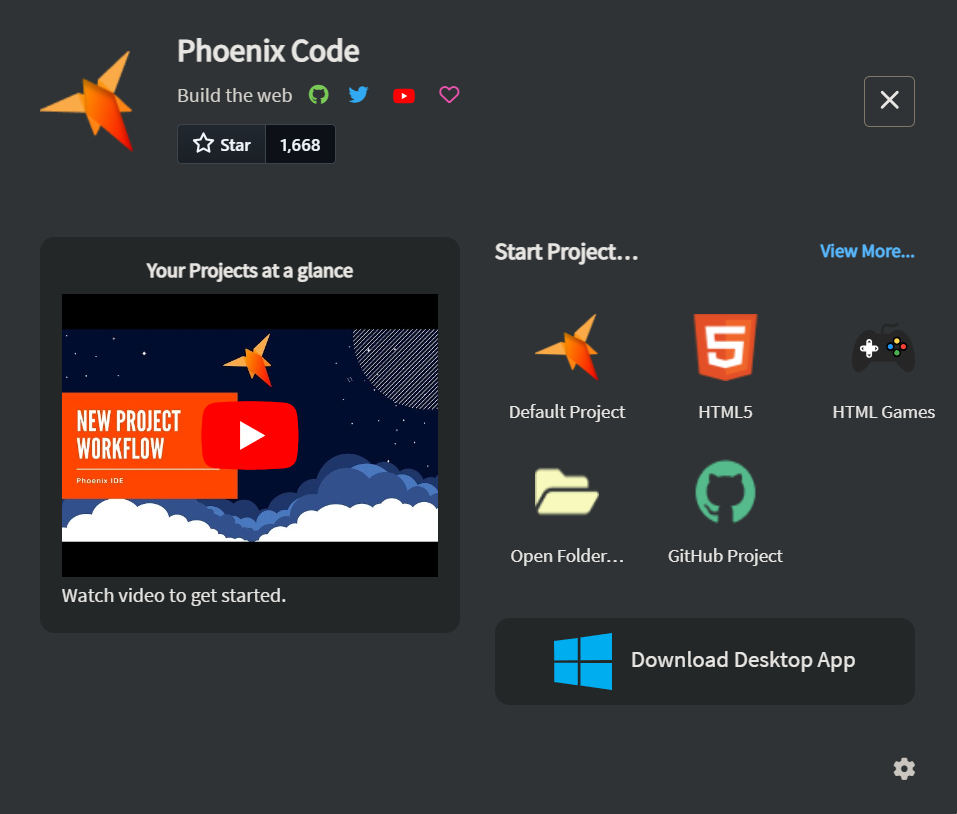
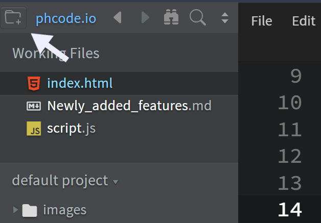
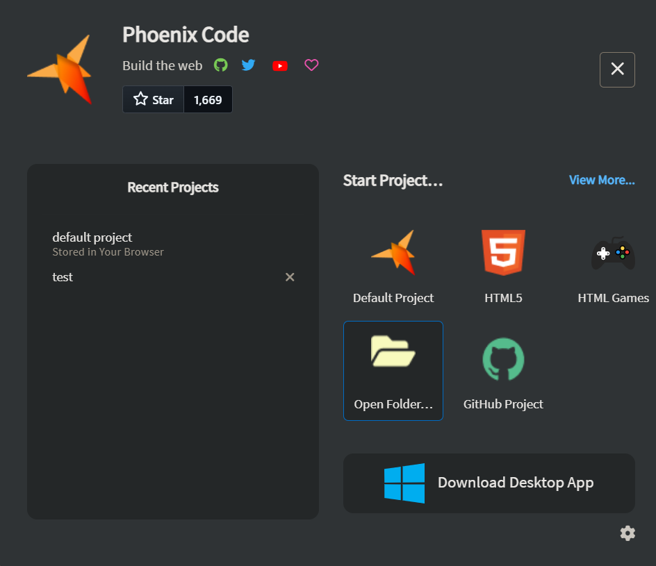
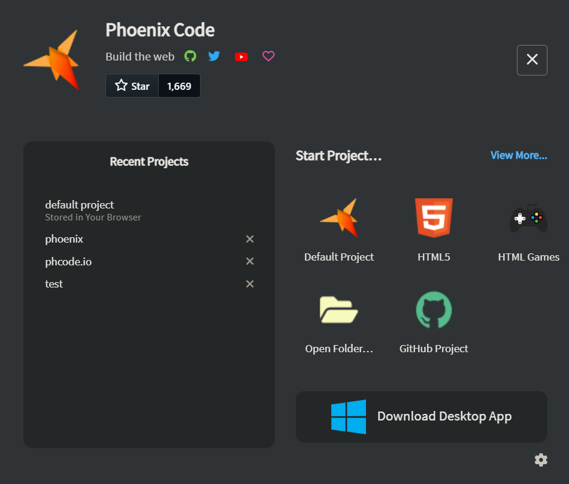

import React from 'react';
import VideoPlayer from '@site/src/components/Video/player';

This section provides an overview of how to create and manage projects using the Start Project Dialog in Phoenix Code.

## Start Project Dialog
When you open the Phoenix Code desktop app or browser app, you are greeted with the `Start Project Dialog` box. This serves as a quick access hub, allowing you to create new projects, resume recent ones, import from GitHub and many more.

> You can reopen the Start Project Dialog box anytime by clicking here.

Additionally, if you prefer that the Start Project Dialog doesn't appear every time you open Phoenix Code, follow these steps:
1. Click the `folder icon`  in the top left corner to open the Start Project Dialog, or alternatively you can restart Phoenix Code to have it appear automatically.
2. In the bottom right corner of the dialog, click the `settings icon`.
3. Toggle off the **`Show This Dialog on Startup`** option.

<VideoPlayer 
  src="https://docs-images.phcode.dev/videos/quick-start-project/turn-off-start-dialog.mp4"
/>

## Default Project
The Start Project Dialog includes an option for creating a Default Project. When selected, a project will be generated with some files to provide a simple starting point for testing and using the Phoenix Code editor.

<VideoPlayer 
  src="https://docs-images.phcode.dev/videos/quick-start-project/default-project.mp4"
/>

## Open Folder

You can open a folder from your desktop in Phoenix Code by following these steps:

1. Click the **`Open Folder`** button in the Start Project Dialog.
2. Navigate to and select your desired project folder.
3. Once selected, Phoenix Code will load all the files, allowing you to start working immediately.

> The **Open Folder** feature is not supported in Firefox browser due to local folder access restrictions. Please use Chrome, Edge, or Opera for working with local folders.

## Create a HTML Project

You can create a new HTML project that includes essential files by following these steps:

1. Open the `Start Project Dialog` box.
2. Click the **`HTML5`** button. This will open a new page for folder selection.
3. Provide a name to the project and choose your desired folder and click **`Create Project`**.

Once completed, a basic project structure will be generated in the selected folder.

<VideoPlayer 
  src="https://docs-images.phcode.dev/videos/quick-start-project/html-project.mp4"
/>

## Create a project from Github

> This feature is only available in the browser app currently. Coming soon to desktop apps.

You can create a project from GitHub and easily import it to your local machine. Follow these steps:

1. Open the `Start Project Dialog` box.
2. Click on the **`GitHub Project`** button.
3. Enter the URL of the GitHub repository you want to work on.
4. Specify the folder location where you want to copy the repository files.
5. Click **`Create Project`**.

After the project is created, you’ll have all the necessary files on your local machine, ready for development.

<VideoPlayer 
  src="https://docs-images.phcode.dev/videos/quick-start-project/github-project.mp4"
/>

## Recent Projects

In the Start Project Dialog, the **`Recent Projects`** section displays a list of all the projects you've recently worked on.

> To remove a project from the Recent Projects list, click the **cross** button next to the project name.

If no recent projects are available, a YouTube video explaining the Start Project dialog options will be displayed instead.

## View More Option

In the Start Project Dialog, the **`View More`** button provides access to a selection of pre-made HTML page templates, such as a home page, blog page, and HTML dashboard.

To use these templates:

1. Click the **`View More`** button.
2. A new page will appear, allowing you to select the folder where you want to create the project.
3. Click **`Create Project`** to generate the chosen template.

<VideoPlayer 
  src="https://docs-images.phcode.dev/videos/quick-start-project/view-more-option.mp4"
/>
