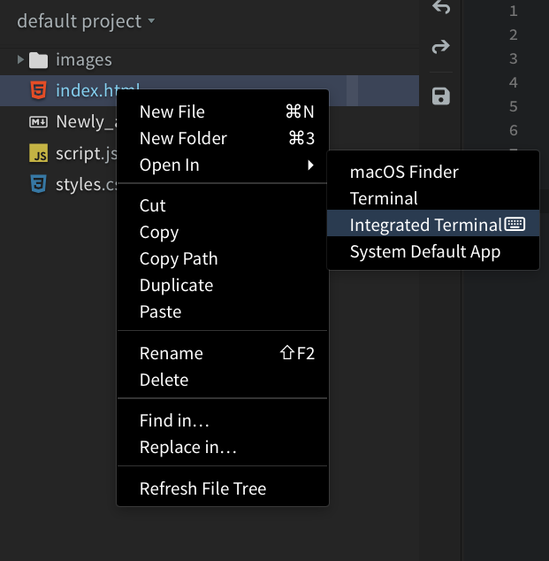
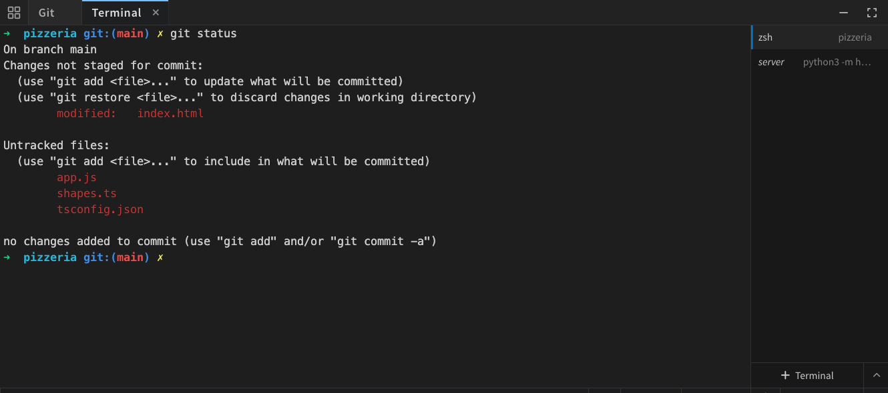
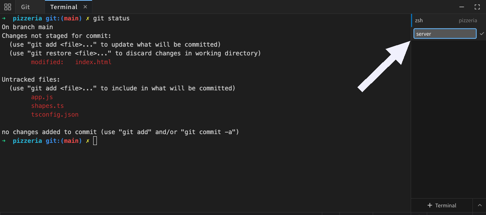
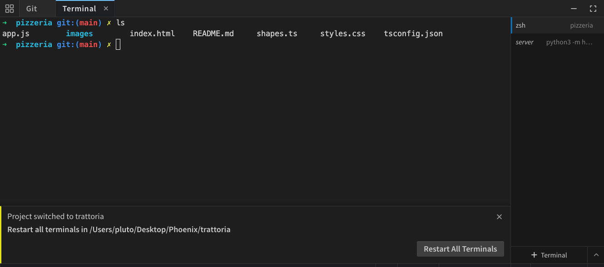

import React from 'react';
import VideoPlayer from '@site/src/components/Video/player';

Phoenix Code has a built-in terminal so you can run commands without leaving the editor.

> The terminal is available only in desktop apps.

<VideoPlayer src="https://docs-images.phcode.dev/videos/terminal/terminal-workflow.mp4" />

## What you can do

A real terminal lives inside Phoenix Code now.

- **[Tabbed terminal](#tabs)** — open multiple shells at once, each with running-process info and friendly close prompts.
- **Right-click** for Copy, Paste, and Clear.
- **Clickable links**: `http` and `https` addresses in the output open in your default browser.
- **[Open in Integrated Terminal](#opening-the-terminal)** from any folder in the file tree.
- **[Shift+Escape](#keyboard-shortcuts)** flips focus between editor and terminal; **F4** opens the panel and cycles between terminal tabs when multiple are open.
- **[All keyboard shortcuts](#keyboard-shortcuts)** route to the terminal when it's focused — `Ctrl+L`, `Ctrl+K`, the works.

## Opening the Terminal

Open the terminal in any of these ways:

- Click the **Terminal** button in the bottom-right toolbar
- Go to **View > Terminal** from the menu bar
- Press `F4`
- Right-click a file or folder in the project tree and choose **Open In > Integrated Terminal**. The terminal opens at that folder (or the file's containing folder)

:::note
**Terminal** opens your system's terminal app (macOS Terminal, Windows Command Prompt, etc.) at that location. 

**Integrated Terminal** opens inside Phoenix Code's built-in panel.
:::

## Tabs

You can have multiple terminals open at the same time, each in its own tab. The tab sidebar shows the running process name for each terminal.

To create a new tab, click the **+** button at the bottom of the tab sidebar.

To close a single tab, hover over it and click the **X** button. To close every terminal at once, click the panel's X button. Phoenix Code asks for confirmation if any process is still running.

When the terminal is focused and more than one tab is open, pressing `F4` cycles to the next tab.

### Renaming a Terminal

Hover a tab and click the **pencil**, type a name, and press `Enter`. Press `Escape` to cancel. Clear the name to go back to the process name.

Named tabs come back the next time the panel opens with no terminals. The shells start fresh, only the tabs and their names are restored. Closing a named tab removes it from this list.

## Shell Selection

Click the **dropdown button** *(chevron icon)* next to the new tab button to pick a different shell. The default options are:

- **macOS**: zsh, bash, fish
- **Linux**: bash, zsh, fish
- **Windows**: PowerShell, Command Prompt, Git Bash, WSL

Selecting a shell sets it as the default and opens a new terminal with it right away.

> Only shells installed on your system are shown. Any other compatible shell on your system (for example, PowerShell Core on Windows) also appears in the list.

## Switching Projects

When you switch projects, open terminals stay in their current folders.
Running commands keep going.

A banner in the panel reads **Project switched to** with the project name, followed by the folder the terminals would restart in. It gives you two choices:

- **Restart All Terminals** restarts all tabs in the new project folder. This stops running commands and clears the output.
- **x** closes the banner and keeps your terminals running.

The banner shows only while a terminal still belongs to another project. It goes away when you return to that project or close those terminals.

If a command is still running, Phoenix Code asks for confirmation before restarting.

To keep your sessions and open a terminal in the new project, click **+ Terminal** shown on the bottom of the right sidebar.

<VideoPlayer
  src="https://docs-images.phcode.dev/videos/terminal/project-switching.mp4"
/>

## Keyboard Shortcuts

| Action | Shortcut |
|--------|----------|
| Open terminal / cycle to next tab (when more than one is open) | `F4` |
| Switch focus between editor and terminal | `Shift + Escape` |
| Clear terminal buffer | `Ctrl/Cmd + K` |
