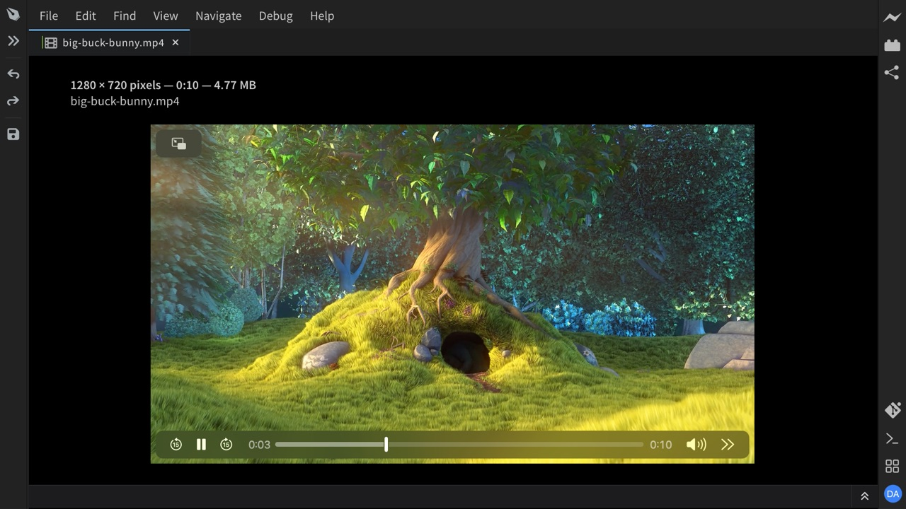

**Phoenix Code** plays video and audio files right in the editor. Click a media file in the file tree and it opens with playback controls, no setup needed.

Above the player you see the file's details: dimensions (for videos), duration, and file size, followed by the file's path.

## Supported Formats

- **Video**: `mp4`, `m4v`, `webm`, `mkv`, `ogv`, `mov`
- **Audio**: `mp3`, `wav`, `ogg`, `m4a`, `flac`, `aac`, `aif`, `aiff`

> Whether a format plays can also depend on the codecs your operating system provides. If a file cannot be played, Phoenix Code shows a message stating that it cannot be played.

Files up to 16 MB can be previewed. If you edit a media file outside Phoenix Code, the preview refreshes automatically.
