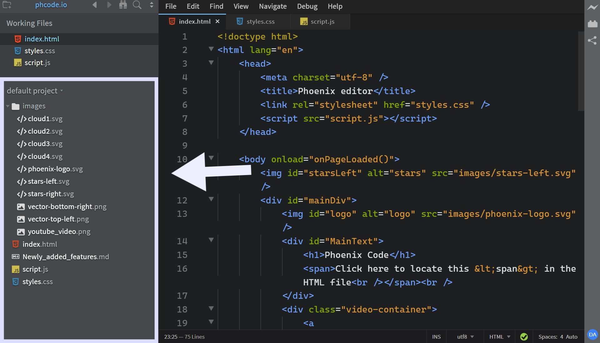
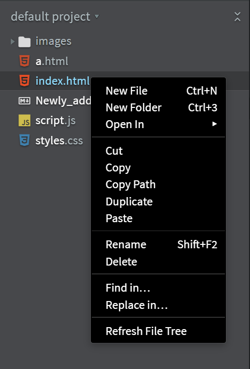
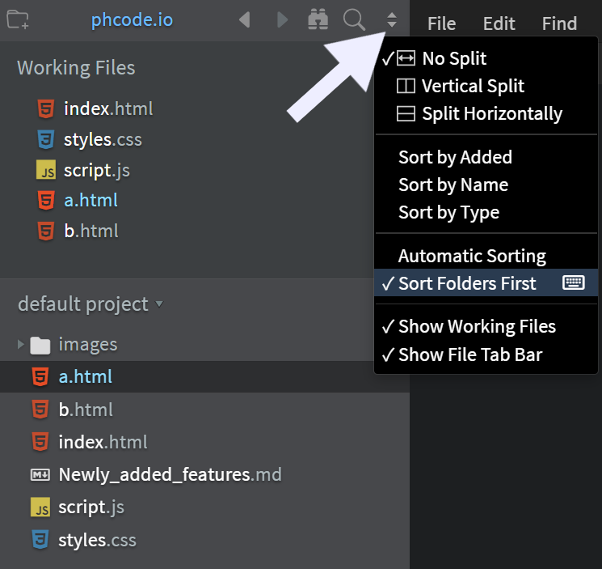
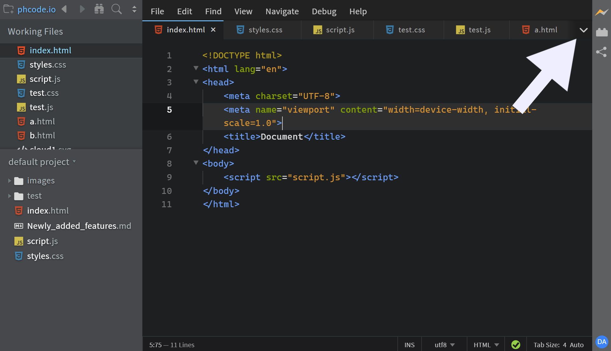
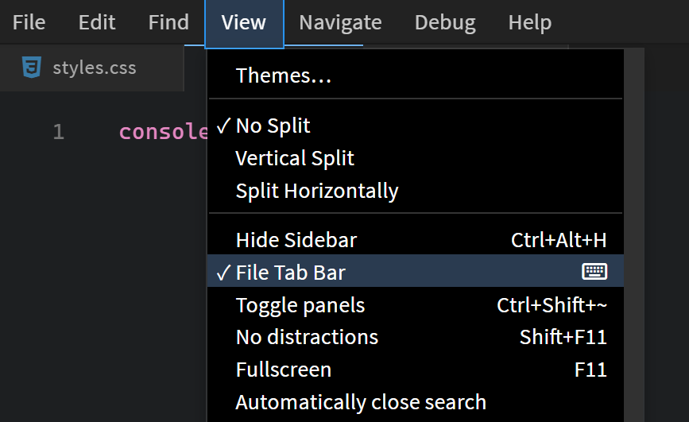
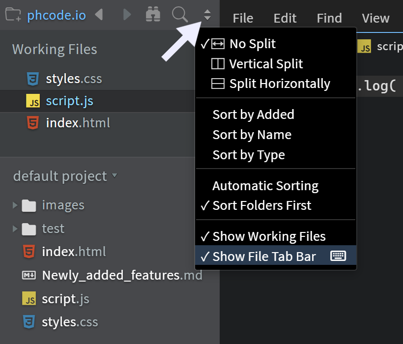
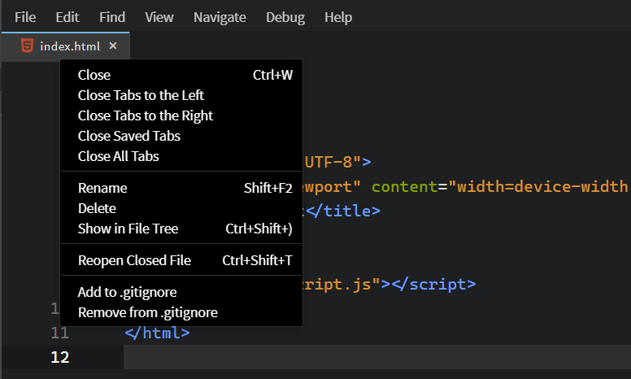

import React from 'react';
import VideoPlayer from '@site/src/components/Video/player';

This section covers how **Phoenix Code** lets you manage, organize, and navigate files and folders within your projects.

---

## File Tree

The **File Tree** appears in the sidebar and shows the complete folder structure of the open project.
It lists all files and folders in a hierarchical view.



### File Tree Context Menu

When you right-click within the File Tree, a context menu appears which allows you to perform various operations.
> All file and folder operations, such as creating, renaming, and deleting are generally performed through this context menu.

The element you right-click in the File Tree becomes the selected context, meaning any operation performed will apply to that item. For example:
- Right-click a **file** → the action applies to that file.
- Right-click a **folder** → the action applies to or inside that folder (e.g., add file, create subfolder, delete contents).
- Right-click on **empty space** → the action applies to the project’s root directory.


> In this example, `index.html` is selected as the context. Any action from the context menu will apply to that file.

The File Tree updates automatically, but if files or folders appear missing, use `Refresh File Tree` option in the context menu to manually reload it. This option forces a full refresh of the tree view.

You can also assign or update keyboard shortcuts for any File Tree action through the context menu.
See the [Keyboard Shortcuts Guide](./Features/keyboard-shortcuts) for complete details.

### Sorting Files and Folders

By default, the File Tree sorts folders first (in ascending order *a-z*), followed by files.

To sort folders and files together:
1. Click the **double-arrow** at the top-right of the sidebar.
2. In the dropdown, uncheck **Sort Folders First**.



Alternatively, you can control this behavior by updating the `sortDirectoriesFirst` property in the preferences file.
See [Editing Preferences](./editing-text#editing-preferences) for details.

Now, files and folders are sorted together in one ascending list.

> Notice how the `images` folder now appears in alphabetical order with other items.

### Collapse All Folders

The **Collapse All Folders** feature helps you quickly reset your view by collapsing all expanded folders to their root level, leaving only the top-level items visible in the File Tree.

To collapse all folders:
1. Hover over the File Tree header at the top-right.
2. Click the `collapse icon` (two arrows pointing toward each other) that appears.

<VideoPlayer
  src="https://docs-images.phcode.dev/videos/file-management/collapse-folders.mp4"
/>

---

## Tab Bar

The **Tab Bar** appears at the top of the editor and displays all open files.
Each file in the Tab Bar is referred to as a **tab**, and you can open as many tabs as you like.
*The Tab Bar helps you switch quickly between files while working.*


The active tab is highlighted with a *blue* marker to distinguish it from inactive ones.
To switch between tabs, simply click the tab you want to view.

To close a tab, click the `×` button beside its name.
For inactive tabs, this button appears only when you hover over them.

**Phoenix Code** shows a small `•` icon on tabs that have unsaved changes.

When multiple tabs have the same name, **Phoenix Code** displays their parent folder name so you can easily tell them apart.
> Hovering over a tab will show a tooltip with its full path.


> The image above shows various UI elements of a tab.

### Tab Bar in Split Panes
When multiple panes are open, each pane has its own Tab Bar and maintains its own list of open tabs.

The active tab in the **active pane** is marked in *blue*,
while the active tab in an **inactive pane** appears in *gray*.


> A file can appear as a tab in more than one pane.

### Hidden Tabs
When you open a new file, its tab is added to the right of the existing tabs.
If there are more tabs than can fit within the visible area, **Phoenix Code** displays a **Show Hidden Tabs** button.



Clicking this button opens a dropdown list of all tabs that are not fully visible.
From this list, you can select a tab to bring it into view or close tabs directly from the dropdown.

<VideoPlayer
  src="https://docs-images.phcode.dev/videos/file-management/overflow-tabs.mp4"
/>

### Drag-Drop Tabs
You can reorder tabs by dragging and dropping them.
While dragging, **Phoenix Code** highlights the drop position with a vertical blue marker, showing exactly where the tab will be placed.

Tabs can also be dragged between panes.
<VideoPlayer
  src="https://docs-images.phcode.dev/videos/file-management/drag-drop-tabs.mp4"
/>


### Showing or Hiding the Tab Bar
You can enable or disable the Tab Bar in several ways:

#### 1. From the View Menu
Go to `View > File Tab Bar` to toggle it on or off.



#### 2. From the Sidebar
Click the **double-arrow** icon in the top-right corner of the sidebar,
then use the `Show File Tab Bar` option in the dropdown to toggle the Tab bar.



#### 3. From Preferences**
You can also toggle the Tab bar by updating the `showTabBar` option in the preferences file.
```json
"tabBar.options": {
    "showTabBar": false
}
```
*Add this in your preferences file to hide the Tab bar.*
Set the value to `true` to enable it.
See [Editing Preferences](./editing-text#editing-preferences) if you need help in editing the preferences.

### Limiting the Number of Tabs
**Phoenix Code** allows you to control the maximum number of tabs visible in the Tab Bar at once.
By default, the value is set to `-1`, which means all open tabs are displayed.

For example, if you want to show a maximum of **3 tabs** in the Tab Bar, you can add the following to your preferences file:

```json
"tabBar.options": {
    "numberOfTabs": 3,
    "showTabBar": true
}
```
You can set `numberOfTabs` to any positive number to define the maximum tab limit.
If you set it to `0`, the Tab Bar will be hidden entirely.
Any negative value (such as `-1`) displays all open tabs without restriction.
> The active tab is always visible, except when the `numberOfTabs` value is set to `0`.


### Tab Bar Context Menu
When you right-click a tab, a context menu appears which has multiple options so that you can work with tabs easily.



### Tab Bar Context Menu

When you right-click a tab, a context menu appears with multiple options that make it easy to manage open files.


#### Tab Bar Context Menu Options

* **Close Tab** — Closes the tab that was right-clicked.
  *For example, in the image, the `script.js` tab will be closed.*

* **Close Tabs to the Left** — Closes all tabs to the left of the selected one (excluding the right-clicked tab).
  *In the image, the `styles.css` tab will be closed.*

* **Close Tabs to the Right** — Closes all tabs to the right of the selected one (excluding the right-clicked tab).
  *In the image, the `index.html` tab will be closed.*

* **Close Saved Tabs** — Closes all tabs with saved content. *Tabs for files that have unsaved changes remain open.*

* **Close All Tabs** — Closes every tab currently open in the Tab Bar.

* **Rename** — Allows you to rename the file linked to the selected tab. *When you choose this option, Phoenix Code opens the File Tree (if it is closed) and highlights the file so you can rename it directly.*

* **Delete** — Deletes the file from the project and removes its tab from the Tab Bar.

* **Show in File Tree** – Highlights the selected file in the File Tree so you can locate it easily.

* **Reopen Closed File** — Reopens the most recently closed file or tab.

> These options provide quick access to common file operations directly from the Tab Bar.

#### Git - Tab Bar
**Phoenix Code** integrates with Git. The Tab Bar displays file status indicators, showing which files are untracked or modified.


- A **green marker** indicates an **untracked** file.
- An **orange marker** indicates a **modified** file.

> These indicators appear only when your project is a Git repository.
