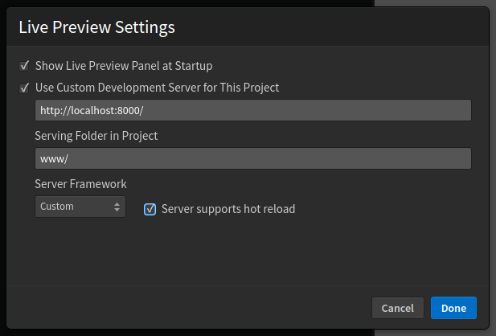

# Custom Live Preview Server

Phoenix Code now allows you to integrate your custom development server directly into the editor, enabling a live preview of your project as it would appear when served by your server. This is especially useful for dynamic projects that rely on server-side languages like PHP or frameworks like React that supports hot reloading.

## Accessing Live Preview Settings

There are two ways to access the Live Preview Settings dialog:

1. **From the File Menu**:
    - Navigate to the 'File' menu at the top left of the editor.
    - Select 'Live Preview Settings' from the dropdown.

1. **From the Live Preview Panel**:
    - Locate the live preview panel, typically found at the right side of the editor.
    - Hover over the live preview panel title bar and click the gear icon (⚙️) located at the top right of the panel title bar.

## Configuring Your Server

Within the Live Preview Settings dialog, you can configure the following options:

- **Show Live Preview Panel at Startup**: Check this option if you want the live preview panel to open automatically when you launch Phoenix Code.

- **Use Custom Development Server for This Project**: Enable this option to use your custom server for the live preview.

    - **Server URL**: Enter the full URL where your server is running, including the port number (e.g., `http://localhost:8000`).

    - **Serving Folder in Project**: Specify the path to the folder in your project that your server serves (e.g., `www/`, default is `/`, ie the full project is assumed to be served by the given server).

    - **Server Framework**: Choose the framework or environment your server uses from the dropdown menu. If your server supports hot reloading, check the corresponding box to enable this feature. Currently 2 options are supported- [Docusaurus](https://docusaurus.io/) and `unknown`. Select `unknown` for all frameworks that are not `Docusaurus`.

After configuring these settings, click 'Done' to save and apply your settings. The live preview will now use your custom server.

## Hot Reloading

Hot reloading is a feature that automatically updates a web application during development whenever code changes are made, without requiring a manual refresh or losing state. Servers like Webpack Dev Server for JavaScript applications, Flask with Flask-Webpack for Python, and Rails with Webpacker for Ruby on Rails support hot reloading.

In Phoenix Code, if your server supports hot reloading, check the 'Server supports hot reload' checkbox. This lets Phoenix Code update changed components only and prevent full page reloads on code changes. Unchecked, it refreshes the whole page on every save.
