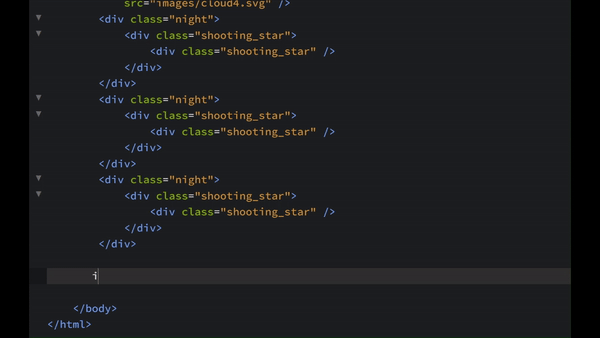

This document provides an overview of the most popular extensions available for Phoenix Code.

## Emmet
Created by: [Emmet.io](https://emmet.io)

Emmet speeds up HTML and CSS coding by allowing you to write shortcuts that expand into full code snippets.

For more details, visit the [website of Emmet](https://emmet.io/).

`Emmet` in action :-

## Minimap
Created by: [Zorgzerg](https://github.com/zorgzerg)

This extension adds a minimap preview of your code on the side of your editor, making it easier to navigate and get an overview of your code structure.

For more details, visit the [GitHub repository](https://github.com/zorgzerg/brackets-minimap) of the extension.

`Minimap` in action :-

## Show Whitespace 
Created by: [Dennis Kehrig](https://github.com/DennisKehrig)

This extension allows users to visualize spaces and tabs, making code more readable and helping maintain formatting consistency.

For more details, visit the [GitHub repository](https://github.com/DennisKehrig/brackets-show-whitespace) of the extension.

`Show Whitespace` in action :-

## 1-2-3
Created by: [Michaljerabek](https://github.com/michaljerabek)

Generates number sequences directly in your editor, making it easy to create ordered lists or numbered markers with minimal effort.

For more details, visit the [GitHub repository](https://github.com/michaljerabek/1-2-3) of the extension.

`1-2-3` in action :-

## FuncDocr
Created by: [Wikunia](https://github.com/Wikunia)

This extension generates JS/PHPDocs for your functions, keeping your code documented and organized.

For more details, visit the [GitHub repository](https://github.com/wikunia/brackets-funcdocr) of the extension.

`FuncDocr` in action :-

