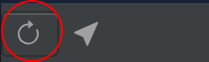

import React from 'react';
import VideoPlayer from '@site/src/components/Video/player';

The Live Preview feature in Phoenix Code provides instant feedback on changes made to HTML and CSS files, enabling developers to see their edits in real-time. This feature is activated by default for HTML projects, while other project types require manual setup.

## Activating Live Preview for HTML Files
1. Select the HTML file you wish to edit from the editing panel.
   .
2. Click the lightning bolt icon, located on the right panel, to initiate Live Preview.
   .
3. The icon turns gold when Live Preview is active.
   
   View the side-by-side Live Preview alongside the code.
   .

## Detaching Live Preview to a New Window
1. Hover over the Live Preview panel.
2. Click the pop-out icon to detach Live Preview into a new window.
   .
3. Live Preview will now display in your default web browser, allowing for uninterrupted coding and viewing.

## Selecting a Browser for Live Preview
1. Hover over the Live Preview panel.
2. Choose your preferred browser by clicking its icon. .
3. Live Preview opens in the chosen browser.

## Reload Live Preview

The **Reload** button in the live preview toolbar allows you to manually refresh the Live Preview pane to ensure it reflects the latest changes in your code. While Live Preview updates automatically, the Reload button can be helpful if you encounter synchronization issues.

## Disable Live Preview
You can disable the live preview panel at startup by following these steps:
1. Click the settings icon in the toolbar (hover over the toolbar to make it appear).

2. This will open the live preview settings menu: 

3. Disable the `Show Live Preview Panel at Startup` option.

## Live Preview Demonstrated
<VideoPlayer 
  src="https://docs-images.phcode.dev/videos/phcode.io-site/live_preview.mp4"
/>

