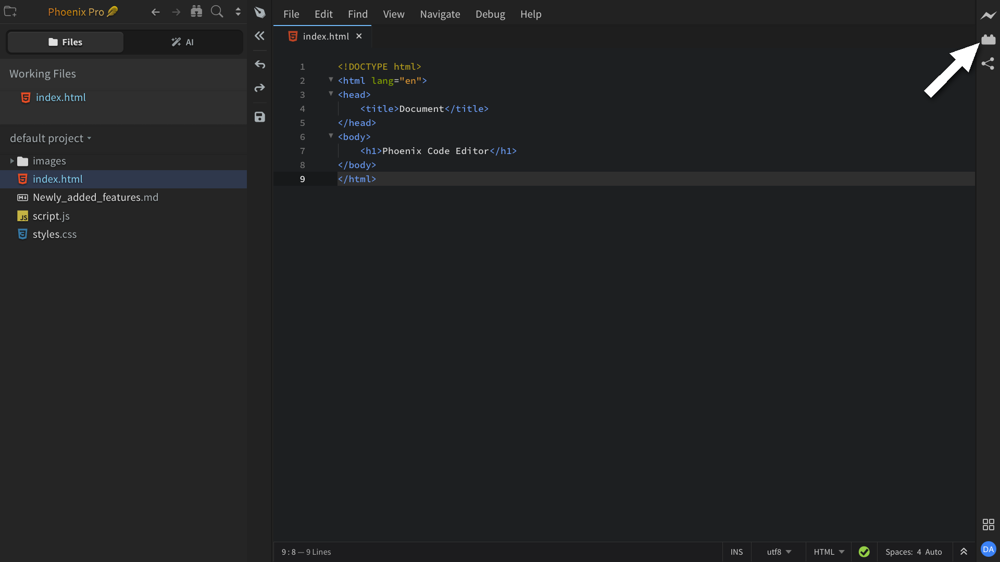
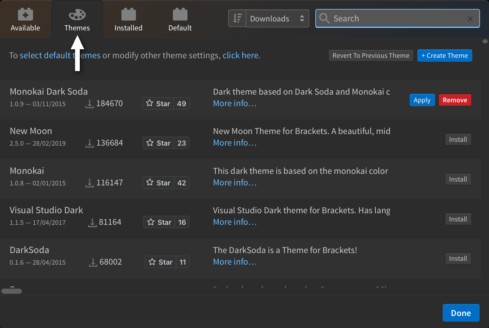
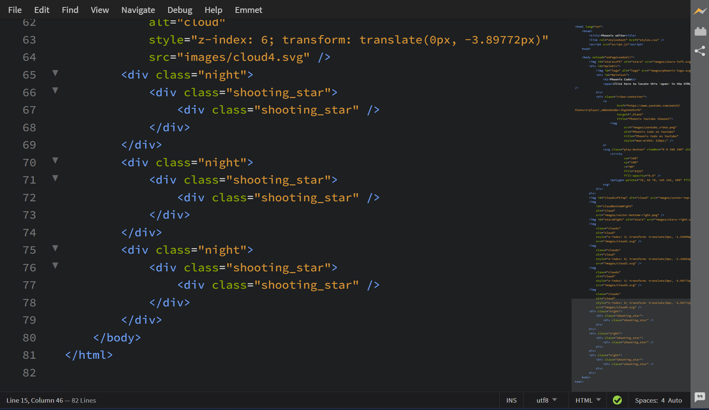
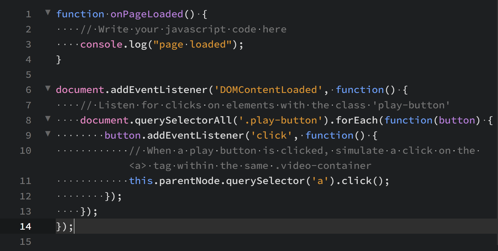
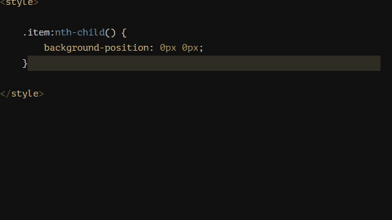
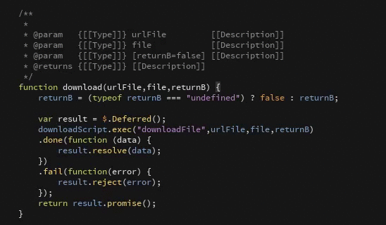

import React from 'react';
import VideoPlayer from '@site/src/components/Video/player';

Phoenix Code supports extensions for adding features, themes, and language support. Everything is managed through the built-in **Extension Manager**.

## Opening the Extension Manager

Click the Extension Manager icon on the right-hand toolbar, or run **Extension Manager…** from the command palette.

## The dialog

Four tabs:

| Tab | Contents |
| --- | --- |
| **Available** | Marketplace extensions. A search box at the top filters the list. |
| **Themes** | Marketplace themes. |
| **Installed** | Everything you've installed. Apply, update, or remove from here. |
| **Default** | Built-in extensions that ship with Phoenix Code. |

<VideoPlayer src="https://docs-images.phcode.dev/videos/extensions/extension-manager.mp4" />

## Installing, updating, removing

- **Install**: pick an item from **Available** or **Themes** and click **Install**.
- **Update**: when a newer version is available, an **Update** button appears on the extension's card in **Installed**.
- **Remove**: click **Remove** on the card in **Installed**, then confirm with **Remove Extensions and Reload**.

## Themes

Themes use the same flow under the **Themes** tab.

To switch to an installed theme, either pick it from `View > Themes...` (see [Customizing the Editor → Themes](./customizing-editor#themes)) or click **Apply** next to the theme in **Installed**.

## Creating your own

For authoring extensions and themes, see the API section:

- [Creating Themes](/api/creating-themes)
- [Creating Extensions](/api/creating-extensions)
- [Creating Node Extensions](/api/creating-node-extensions)
- [Debugging Extensions](/api/debugging-extensions)
- [Publishing Extensions](/api/publishing-extensions)

---

## Popular extensions

A curated list of community extensions worth checking out.

### Minimap
Created by: [Zorgzerg](https://github.com/zorgzerg)

This extension adds a minimap preview of your code on the side of your editor, making it easier to navigate and get an overview of your code structure.

For more details, visit the [GitHub repository](https://github.com/zorgzerg/brackets-minimap) of the extension.

`Minimap` in action :-

---

### Show Whitespace
Created by: [Dennis Kehrig](https://github.com/DennisKehrig)

This extension allows users to visualize spaces and tabs, making code more readable and helping maintain formatting consistency.

For more details, visit the [GitHub repository](https://github.com/DennisKehrig/brackets-show-whitespace) of the extension.

`Show Whitespace` in action :-

---

### 1-2-3
Created by: [Michal Jeřábek](https://github.com/michaljerabek)

This extension generates number sequences directly in your editor, making it easy to create ordered lists or numbered markers with minimal effort.

For more details, visit the [GitHub repository](https://github.com/michaljerabek/1-2-3) of the extension.

`1-2-3` in action :-

---

### FuncDocr
Created by: [Ole Kröger](https://github.com/Wikunia)

This extension generates JS/PHPDocs for your functions, keeping your code documented and organized.

For more details, visit the [GitHub repository](https://github.com/wikunia/brackets-funcdocr) of the extension.

`FuncDocr` in action :-

---

### Remove Comments
Created by: [Pluto](https://github.com/devvaannsh)

This extension allows you to remove unwanted comments from your code. You can delete all comments at once or only those within a selected section.

For more details, visit the [GitHub repository](https://github.com/devvaannsh/Remove-Comments) of the extension.

`Remove Comments` in action :-
<VideoPlayer src="https://docs-images.phcode.dev/videos/popular-extensions/Remove-Comments.mp4" />

---

### Autosave Files on Window Blur
Created by: [Marty Penner](https://github.com/martypenner)

This extension automatically saves all unsaved files whenever Phoenix Code loses focus (for example, when you switch to another application).

For more details, visit the [GitHub repository](https://github.com/martypenner/brackets-autosave-files-on-window-blur) of the extension.

`Autosave Files on Window Blur` in action :-
<VideoPlayer src="https://docs-images.phcode.dev/videos/popular-extensions/autosave.mp4" />
