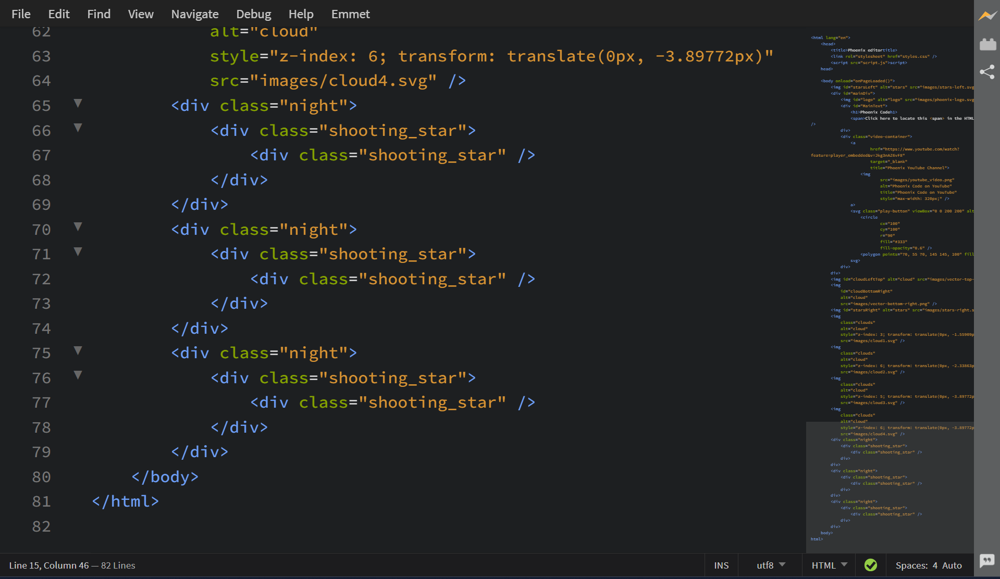
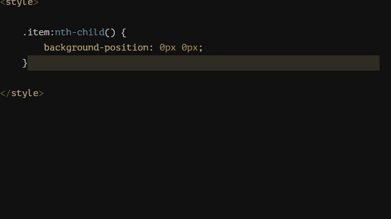

import React from 'react';
import VideoPlayer from '@site/src/components/Video/player';

This document provides an overview of the most popular extensions available for Phoenix Code.

## Minimap
Created by: [Zorgzerg](https://github.com/zorgzerg)

This extension adds a minimap preview of your code on the side of your editor, making it easier to navigate and get an overview of your code structure.

For more details, visit the [GitHub repository](https://github.com/zorgzerg/brackets-minimap) of the extension.

`Minimap` in action :-

---

## Show Whitespace
Created by: [Dennis Kehrig](https://github.com/DennisKehrig)

This extension allows users to visualize spaces and tabs, making code more readable and helping maintain formatting consistency.

For more details, visit the [GitHub repository](https://github.com/DennisKehrig/brackets-show-whitespace) of the extension.

`Show Whitespace` in action :-

---

## 1-2-3
Created by: [Michal Jeřábek](https://github.com/michaljerabek)

This extension generates number sequences directly in your editor, making it easy to create ordered lists or numbered markers with minimal effort.

For more details, visit the [GitHub repository](https://github.com/michaljerabek/1-2-3) of the extension.

`1-2-3` in action :-

---

## FuncDocr
Created by: [Ole Kröger](https://github.com/Wikunia)

This extension generates JS/PHPDocs for your functions, keeping your code documented and organized.

For more details, visit the [GitHub repository](https://github.com/wikunia/brackets-funcdocr) of the extension.

`FuncDocr` in action :-

---

## Remove Comments
Created by: [Pluto](https://github.com/devvaannsh)

This extension allows you to remove unwanted comments from your code. You can delete all comments at once or only those within a selected section.

For more details, visit the [GitHub repository](https://github.com/devvaannsh/Remove-Comments) of the extension.

`Remove Comments` in action :-
<VideoPlayer src="https://docs-images.phcode.dev/videos/popular-extensions/Remove-Comments.mp4" />

---

## Autosave Files on Window Blur
Created by: [Marty Penner](https://github.com/martypenner)

This extension automatically saves all unsaved files whenever Phoenix Code loses focus (for example, when you switch to another application).

For more details, visit the [GitHub repository](https://github.com/martypenner/brackets-autosave-files-on-window-blur) of the extension.

`Autosave Files on Window Blur` in action :-
<VideoPlayer src="https://docs-images.phcode.dev/videos/popular-extensions/autosave.mp4" />
