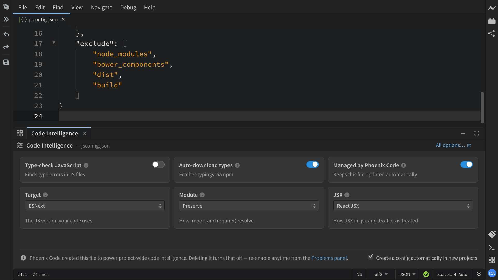

import VideoPlayer from '@site/src/components/Video/player';

**Phoenix Code** ships full code intelligence for JavaScript, TypeScript, JSX, and TSX, powered by the TypeScript language server. It understands your whole project, so completions, navigation, and error checking work across files. It is on by default, so you don't need to setup anything!

<VideoPlayer
  src="https://docs-images.phcode.dev/videos/code-intelligence/code-intelligence.mp4"
/>

:::info Desktop Only
Browser version runs on classic JavaScript hints. For smarter Code intelligence, switch to the desktop app.
:::

Code hints, parameter hints, hover info, jump to definition, and error checking all work as described in [Code Intelligence](./Code%20Intelligence). This page covers what is specific to JavaScript and TypeScript.

## Auto Imports

Suggestions are drawn from your project and the libraries you use.

- Picking a symbol from another file or module automatically adds the import at the top of your file.
- If the same name exists in several modules, the hint shows how many and lets you choose which one to import.

## Type Checking

Errors and warnings from the language server appear in the [Problems panel](/docs/Features/Problems%20Panel/ESLint) as you type, with a **Fix** button when a fix is available.

> In plain JavaScript files, type warnings are off by default. Turn on **Type-check JavaScript** in the [config panel](#the-config-panel) to get them.

## Project-Wide Intelligence

To understand your whole project, Phoenix Code needs a small config file (`jsconfig.json` or `tsconfig.json`) in the project root. It creates this file automatically the first time you open a JavaScript or TypeScript file, and keeps it updated for you. The file itself contains a note explaining why it is there and states that Phoenix Code auto-created this file.

To disable or self-manage Project-Wide Intelligence:

- **To turn it off**, delete the file. Phoenix Code will not create it again, and the [Problems panel](/docs/Features/Problems%20Panel/ESLint) offers a one-click re-enable if you change your mind.
- **To manage the file yourself**, set `autoManage` to `false` inside it. Phoenix Code will never modify it again.
- **To stop it for all projects**, set the `codeIntel.autoCreateConfig` [preference](/docs/editing-text#editing-preferences) to `false`.

## The Config Panel

When you open `jsconfig.json` or `tsconfig.json`, Phoenix Code shows a **Code Intelligence** panel that explains the most useful ones in plain words:

- **Type-check JavaScript**: Finds typos and type mistakes in your JS files and shows them in the Problems panel. Warnings only, your code runs unchanged.
- **Auto-download types**: Fetches type definitions for your npm packages, so code hints for them work even before you run `npm install`.
- **Managed by Phoenix Code**: Whether Phoenix Code keeps the file updated automatically.
- **Target**, **Module**, and **JSX**: The JavaScript version, module system, and JSX handling your project uses.

Click **All options…** to read about every available setting in the [TypeScript config reference](https://www.typescriptlang.org/tsconfig/).
