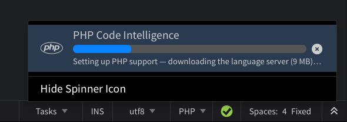

**Phoenix Code** supports full code intelligence for PHP: completions with documentation, parameter hints, hover info, Go to Definition, Find Usages, and error checking in the Problems panel.

Everything works the same way as described in [Code Intelligence](./Code%20Intelligence).

:::info Desktop Only
PHP code intelligence runs in the desktop app.
:::

## Automatic Setup

PHP code intelligence is powered by [Intelephense](https://intelephense.com). Phoenix Code downloads it the first time you open a PHP file. The progress shows in the status bar, with a stop button to cancel.



> Updates are automatic, and if you are offline, the download waits for a connection.

To turn PHP code intelligence off, set the `codeIntelligence.php` [preference](/docs/editing-text#editing-preferences) to `false`. Setting it back to `true` downloads the server again.

> HTML, CSS, and JavaScript inside your PHP files keep their existing code hints. Intelephense handles only the PHP parts.

## Premium Features

The free version of Intelephense covers everything described above. If you own an [Intelephense premium license](https://intelephense.com), set the `php.licenseKey` [preference](/docs/editing-text#editing-preferences) to your license key, or to the path of your license file.

## Working With Frameworks (WordPress, Laravel, etc.)

PHP code intelligence only knows about the PHP files it can see. If your project is a WordPress theme or plugin (or any codebase that leans on functions/constants defined by a framework you don't have locally, like `get_header()`), those calls show up as **"Undefined function"** errors in the [Problems panel](/docs/Features/Problems%20Panel/ESLint) even though the code is correct.

Fix this by dropping an `intelephense.config.json` file in your project root, then restart Phoenix Code (or switch between projects) so PHP code intelligence picks it up.

**Recommended: point it at the framework's stub files** so the functions are actually recognized (you get real hover info and completions, not just silence):

```json
{
    "environment": {
        "includePaths": ["vendor/php-stubs/wordpress-stubs"]
    }
}
```

Install the stubs with Composer first. Open **View > Terminal** for a terminal already rooted at your project (same steps on Windows, macOS, and Linux), then run:

```bash
composer require --dev php-stubs/wordpress-stubs
```

> Needs [Composer](https://getcomposer.org/download/) installed. If the command isn't found, install Composer first (its site has steps for Windows, macOS, and Linux).

Similar stub packages exist for WooCommerce, Laravel, and other frameworks.

> Composer puts the stubs inside your project (`vendor/…`), so the path above works as-is on Windows, macOS, and Linux. Pointing `includePaths` at your actual local WordPress install instead would work too, but the path is different for every setup (XAMPP, MAMP, Local, Docker, …) and you'd have to track it down yourself — the stub package sidesteps that entirely.

**Quicker: just turn the check off**, if you don't want to set up stubs:

```json
{
    "diagnostics": {
        "undefinedFunctions": false
    }
}
```

> This only silences the error. Code intelligence still doesn't know what these functions are, so you won't get hover docs or autocomplete for them — use the stub option above for that.

Commit `intelephense.config.json` to your repo so the whole team gets the same settings. See the [configuration reference](https://intelephense.com/docs) for the full list of `diagnostics` and `environment` options.

## Running PHP Pages

This page is about editing PHP. To preview PHP pages in the Live Preview, see [PHP Live Preview Setup](/docs/Features/Live%20Preview/php-live-preview).
