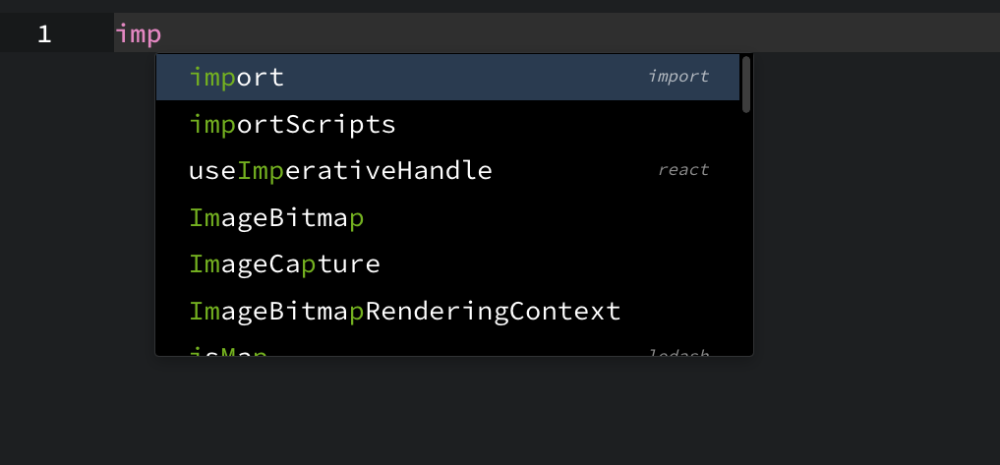
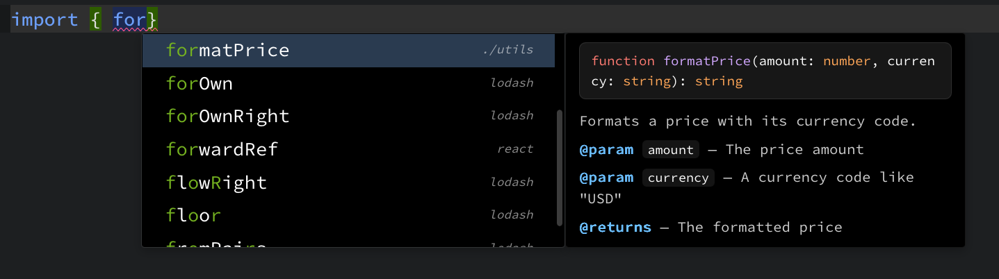
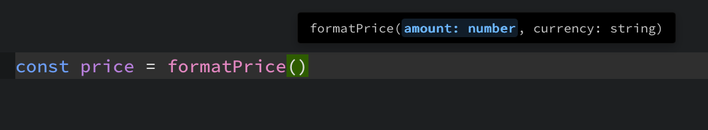
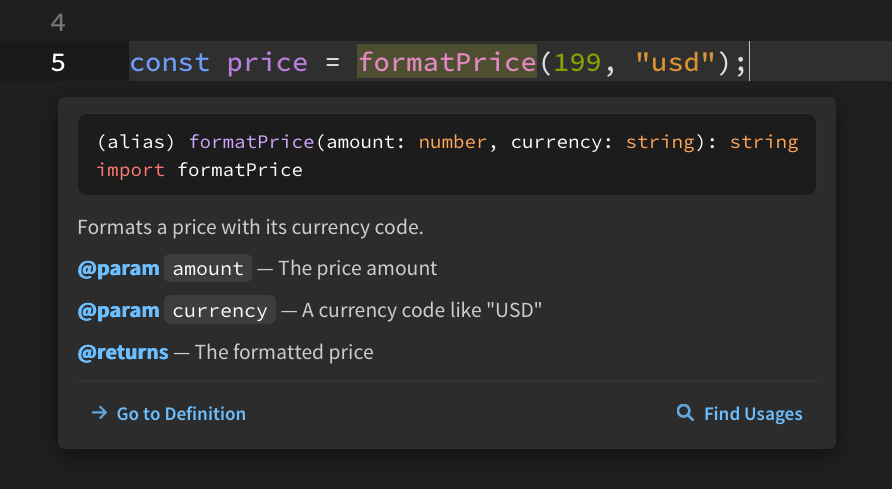
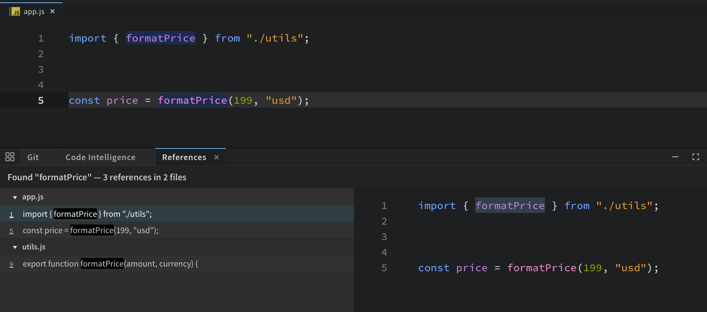
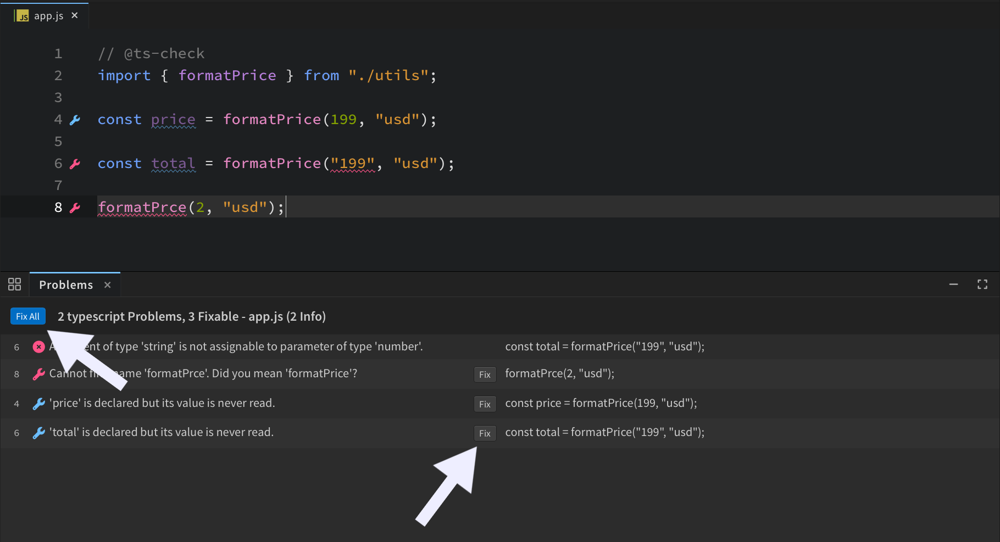

import VideoPlayer from '@site/src/components/Video/player';

**Phoenix Code** helps you write code faster with code hints, parameter hints, documentation popups, jump to definition, and live error checking. Most of it works out of the box with no setup.

<VideoPlayer
  src="https://docs-images.phcode.dev/videos/code-intelligence/code-intelligence.mp4"
/>

This page explains what each feature does and how to tune it. For what you get in a specific language, see [JavaScript & TypeScript](./js-ts-code-intelligence), [PHP](./php-code-intelligence), [JSON](./json-code-intelligence), and [Python](./python-code-intelligence).

## Code Hints

As you type, a popup suggests what could come next: HTML tags, CSS properties and values, JavaScript symbols, JSON keys, file paths, and more.

- Hints appear automatically as you type.
- Press `Ctrl + Space` to open them any time, or use `Edit > Show Code Hints`.
- Use the arrow keys to pick one, then press `Enter` or `Tab` to insert it.
- Press `Esc` to close the popup.



### Documentation Beside Hints

For languages with full code intelligence, the selected hint shows a documentation popup next to the list, with a short description of the function, property, or symbol. This lets you confirm it is the right one before you insert it.



## Parameter Hints

When you type inside a function call, right after `(` or `,`, a popup shows the function's parameters and highlights the one you are on. It follows your cursor as you move between arguments.

Press `Ctrl + Shift + Space` to show it any time, or use `Edit > Show Parameter Hint`.



## Hover Info

Hold your cursor over any symbol to see its type signature and documentation. The popup also has two buttons, **Go to Definition** and **Find Usages**.



## Jump to Definition and Find Usages

Place your cursor on a symbol and press `Ctrl/Cmd + J` to go to where it is defined, even in another file. This is also in `Navigate > Jump to Definition`.

Press `Shift + F12` to list every place the symbol is used across the project. This is also in `Find > Find All References`.



Both are in the right-click menu too.

## Error Checking

Phoenix Code checks your code as you type and shows problems in two places:

- **Squiggly underlines** in the editor, under the exact code with the problem. Hover over the underline to read the message.
- The **Problems panel** at the bottom of the window, listing every problem in the file with its line number. Click a row to jump to it.

Problems come in three levels: **Error** (red), **Warning** (yellow), and **Info** (blue).

Two kinds of problems also change how the code looks, so you can spot them at a glance:

- **Unused code**, like a variable that is never read or an import that is never used, is drawn faded.
- **Deprecated code**, like calling a function marked `@deprecated`, is drawn with a strikethrough.

These still get their underline and their row in the Problems panel. The styling is an extra hint on top.



### Quick Fixes

When a problem can be fixed automatically, a **Fix** button appears next to it in the Problems panel. Use **Fix All** to apply every fix in the file at once.

## Language Support

### Works Everywhere

These hints work in the desktop app and in the browser:

| Language or context | What you get |
| --- | --- |
| HTML | Tag names, attribute names and values |
| HTML entities | Special characters like `&amp;` and `&nbsp;` |
| CSS, LESS, SCSS | Property names and property values |
| SVG | Tag and attribute hints |
| JavaScript | Symbol completion |
| URLs | File path completion inside `href`, `src`, and `url()` |
| Preferences files | Hints for every setting name and value while editing Phoenix Code's own settings files |

### Desktop App

The desktop app also runs **language servers**. A language server understands your whole project, not just the open file, so you get context-aware completion, documentation popups, parameter hints, jump to definition, and project-wide error checking.

| Language server | Languages | What you get |
| --- | --- | --- |
| TypeScript | JavaScript, TypeScript, JSX, TSX | Type-aware completion, parameter hints, docs on hover, jump to definition, type errors, unused and deprecated detection. Respects your `jsconfig.json` or `tsconfig.json`. See [JavaScript & TypeScript](./js-ts-code-intelligence). |
| JSON | JSON | Schema-based key and value completion and validation for well-known config files. In `package.json`, dependencies with known security problems are flagged. See [JSON](./json-code-intelligence). |
| Intelephense | PHP | Completion, docs on hover, parameter hints, jump to definition, error checking. See [PHP](./php-code-intelligence). |
| Pyrefly and Ruff | Python | Type-aware completion, docs on hover, parameter hints, jump to definition, type checking with Pyrefly, and formatting with Ruff. See [Python](./python-code-intelligence). |

The PHP and Python language servers download and set themselves up the first time you open a PHP or Python file. There is nothing to install by hand.

Language servers run on your own machine as background processes, so your code is not sent anywhere. Because they need those processes, they run in the desktop app only. In the browser, the hints in the table above still work.

Extensions can add language servers for more languages. Each one gets its own on and off setting automatically, see [Language Servers](#language-servers) below.

:::note JavaScript type checking
By default, JavaScript files get completion, docs, and navigation, but not full type checking. This matches what other editors do. To also get type errors and unused variable warnings in plain `.js` files, add `"checkJs": true` to your project's `jsconfig.json`, or put a `// @ts-check` comment at the top of the file.
:::

## Settings

You can turn every part of this on or off from your preferences file. See [Editing Preferences](/docs/editing-text#editing-preferences) to learn how to open and edit it. Preferences files get code hints too, so `Ctrl + Space` works while you edit them.

### General

| Setting | Default | What it does |
| --- | --- | --- |
| `showCodeHints` | `true` | The master switch. Set it to `false` to turn off all code hint popups. |
| `showCodeHintDocs` | `true` | Set to `false` to hide the documentation popup shown beside code hints. |
| `showParameterHints` | `true` | Set to `false` to turn off the parameter hint popup, including `Ctrl + Shift + Space`. |
| `insertHintOnTab` | `true` | Set to `false` if you don't want `Tab` to insert the selected hint. `Enter` still works. |
| `maxCodeHints` | `50` | How many suggestions the popup shows at once. |

### Per-Language Hints

Turn hints off for one language and keep the rest:

| Setting | Default | What it controls |
| --- | --- | --- |
| `codehint.TagHints` | `true` | HTML tag hints |
| `codehint.AttrHints` | `true` | HTML attribute hints |
| `codehint.SpecialCharHints` | `true` | HTML entity hints |
| `codehint.CssPropHints` | `true` | CSS, LESS, and SCSS property and value hints |
| `codehint.SVGHints` | `true` | SVG hints |
| `codehint.JSHints` | `true` | JavaScript hints |
| `codehint.UrlCodeHints` | `true` | File path and URL hints |
| `codehint.PrefHints` | `true` | Hints in Phoenix Code settings files |

### Language Servers

Each language server has its own switch. Turning one off stops it right away, so completion, docs, parameter hints, jump to definition, and error checking for that language all stop, and any simpler built-in checker takes over. Turning it back on restarts the server. You don't need to restart the app.

| Setting | Default | What it controls |
| --- | --- | --- |
| `codeIntelligence.typescript` | `true` | JavaScript and TypeScript code intelligence |
| `codeIntelligence.json` | `true` | JSON code intelligence |
| `codeIntelligence.php` | `true` | PHP code intelligence. Set to `false` before you open a PHP file and the server is never downloaded. |
| `codeIntelligence.python` | `true` | Python code intelligence. Set to `false` before you open a Python file and the server is never downloaded. |
| `codeIntelligence.<id>` | `true` | Any language server added by an extension gets its own setting. Look for the `codeIntelligence.` prefix in the default preferences file to see what is available. |

### Examples

Turn off the popups but keep error checking:

```json
{
    "showCodeHints": false,
    "showParameterHints": false
}
```

Keep the hints, but make them quieter:

```json
{
    "showCodeHintDocs": false,
    "maxCodeHints": 20
}
```

### Settings for One Project

To change a setting for a single project only, create a `.phcode.json` file in the project folder and put the same settings in it. Project settings win over your global ones.

For example, to turn off JavaScript and TypeScript code intelligence in one project:

```json
{
    "codeIntelligence.typescript": false
}
```

## Troubleshooting

### Q. Why don't I see any code hints?

Check that `showCodeHints` is not set to `false`, both in your preferences file and in the project's `.phcode.json`.

### Q. Why do HTML and CSS hints work, but JavaScript feels basic or JSON validation is missing?

Those come from language servers, so they need the desktop app. If you are already on the desktop app, check that `codeIntelligence.typescript` and `codeIntelligence.json` are not set to `false`.

### Q. Why don't I see parameter hints inside a function call?

Check `showParameterHints`. Parameter hints come from a language server, so they also need the desktop app and that language's `codeIntelligence.*` setting turned on.

### Q. Why are unused variables in my `.js` file not flagged?

Plain JavaScript is not type-checked by default. Add `"checkJs": true` to `jsconfig.json`, or put a `// @ts-check` comment at the top of the file.

### Q. How do I stop `Tab` from inserting a hint?

Set `insertHintOnTab` to `false`. `Enter` still inserts the selected hint.
