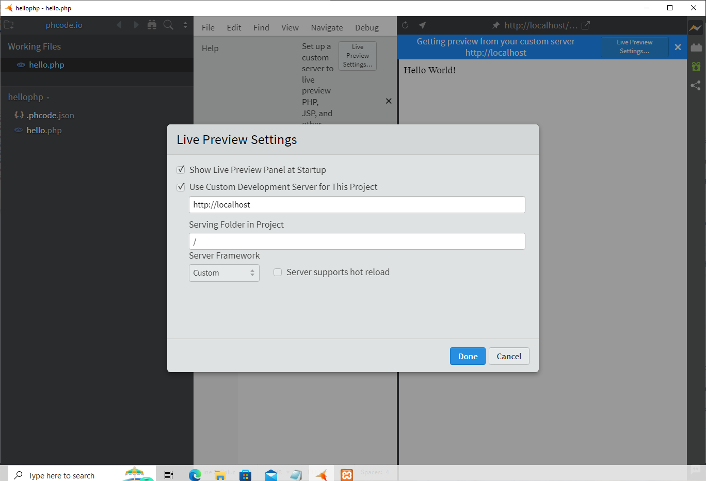

import React from 'react';
import VideoPlayer from '@site/src/components/Video/player';
import Tabs from '@theme/Tabs';
import TabItem from '@theme/TabItem';

Setting up a live preview for PHP projects is straightforward with Apache and XAMPP. Below are the installation and configuration steps for each operating system:

<Tabs
  defaultValue="windows"
  values={[
    {label: 'Windows', value: 'windows'},
    {label: 'Linux', value: 'linux'},
    {label: 'macOS', value: 'macos'},
  ]}>

<TabItem value="windows">
### Steps for Windows
1. Download and install XAMPP from [Apache Friends](https://www.apachefriends.org/).
2. Open the XAMPP Control Panel.
3. Modify the `httpd.conf` file located at `C:\xampp\apache\conf\httpd.conf`:
   ```
   DocumentRoot "C:/path/to/your/project"
   <Directory "C:/path/to/your/project">
   </Directory>
   ```
4. Save the updated configuration.
5. Restart the Apache server through the XAMPP Control Panel.
</TabItem>

<TabItem value="linux">
### Steps for Linux
1. Download and install XAMPP from [Apache Friends](https://www.apachefriends.org/).
2. Open the XAMPP Control Panel by running `sudo /opt/lampp/lampp start` in your terminal.
3. Modify the `httpd.conf` file located at `/opt/lampp/etc/httpd.conf`:
   ```
   DocumentRoot "/path/to/your/project"
   <Directory "/path/to/your/project">
   </Directory>
   ```
4. Save the updated configuration.
5. Restart the Apache server through the XAMPP Control Panel.
</TabItem>

<TabItem value="macos">
### Steps for macOS
1. Download and install XAMPP from [Apache Friends](https://www.apachefriends.org/).
2. Open the XAMPP manager from your Applications folder.
3. Modify the `httpd.conf` file located at `/Applications/XAMPP/xamppfiles/etc/httpd.conf`:
   ```
   DocumentRoot "/path/to/your/project"
   <Directory "/path/to/your/project">
   </Directory>
   ```
4. Save the updated configuration.
5. Restart the Apache server through the XAMPP Control Panel.
</TabItem>

</Tabs>
6. Add the following settings to your custom live preview:

Your live preview should now automatically update to reflect changes whenever PHP files are edited.

## PHP Live Preview in Action

<VideoPlayer 
  src="https://docs-images.phcode.dev/videos/phplp/phplivepreview.mp4"
/>