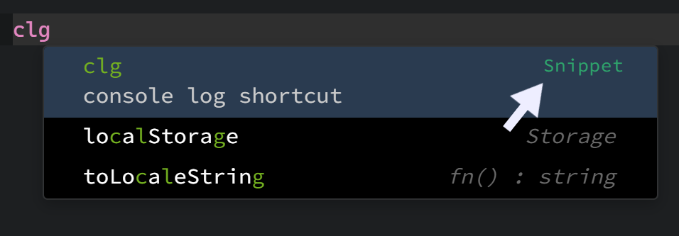
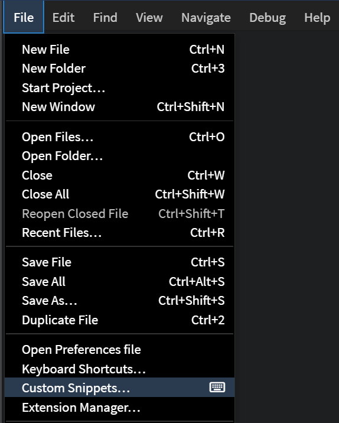
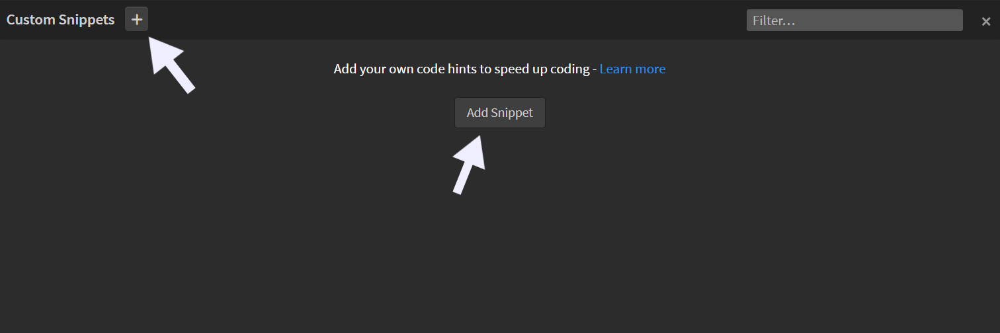
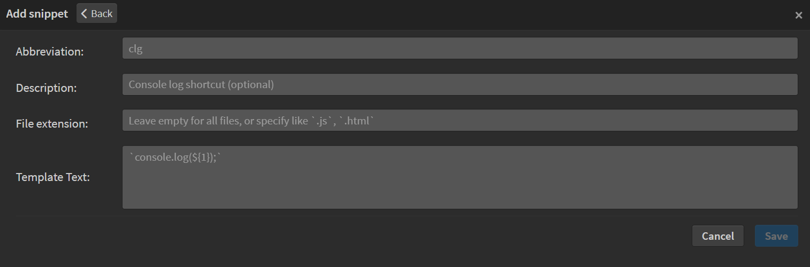

import React from 'react';
import VideoPlayer from '@site/src/components/Video/player';

**Custom Snippets** let you create your own reusable code hints. You can define short abbreviations that expand into full code snippets when selected from the code hints that appear as you type. In the code hint, **Phoenix Code** displays a small `Snippet` label on the right, indicating that the hint comes from custom snippets.

You can also specify which file types each snippet should work with, so they appear only where they’re relevant.

Additionally, you can define the cursor position within a snippet. After expansion, **Phoenix Code** automatically places your cursor exactly where you want it, allowing you to start typing right away.

The snippets you define are available globally, so you don’t need to recreate them for every folder. This helps you write code faster and stay consistent across projects.

> **Note**: Custom Snippets have the highest priority and will appear above all other code hints.

<VideoPlayer
  src="https://docs-images.phcode.dev/videos/custom-snippets/custom-snippets-main.mp4"
/>

---

### Custom Snippets Panel
You can manage all your snippets from the **Custom Snippets** panel.
To access it, navigate to `File` → `Custom Snippets...`.

The panel appears at the bottom of the editor.

If you haven’t added any snippets yet, the panel will be empty.

---

### Add Snippet
To add a snippet, click on the `'+'` button that appears on the panel header.
> Alternatively, if your snippets panel is empty, **Phoenix Code** shows a large `Add Snippet` button in the panel itself.

Clicking on it opens the **Add Snippet** panel.

#### Understanding the Add Snippet Panel
The **Add Snippet** panel contains four input fields, each with placeholder examples to guide you:

| Field | Description |
|-------|--------------|
| **Abbreviation** *required* | The shorthand text that triggers your snippet. For example, typing `clg` could expand into a longer code block. |
| **Description** *optional* | A short explanation of what the snippet expands to. This appears in the code hint. Example: *console log shortcut*. |
| **File Extension** *optional* | Specifies which file types the snippet should be active in. For example, `.js, .ts` will make the snippet available in JavaScript and TypeScript files.  ⚠️ Use file **extensions**, not file or language names, and separate multiple entries with commas.   When left blank, the snippet works for **all** file types. |
| **Template Text** *required* | The actual code or content your snippet expands into. For example, typing `clg` could expand to `console.log();`. |

#### Example Snippet
The image below shows a complete snippet configuration:

After entering the values, click `Save`.
> Your snippet will be added to the list and can be used immediately in **Phoenix Code**.

In the panel header, you can see the total number of snippets you’ve added. You can create as many snippets as you like.

---

### Edit Snippet
You can edit an existing snippet whenever you need to make changes. To edit a snippet, click the snippet you want to edit from the snippets list. This will open the **Edit Snippet** panel.

Update the fields you want to modify.
For example, in the snippet shown below, we’ve updated the **Abbreviation** from `scr` to `script`.
After making your changes, click `Save`.

You can see that the snippet is now updated with the new **Abbreviation**.

---

### Delete Snippet
Deleting a snippet is simple. From the snippets list, click the *Trash Bin* icon on the right side of the snippet you want to remove.
This will immediately delete the snippet.

> ⚠️ Caution: Deleting a snippet is permanent and cannot be undone.

---

### Filter Snippets
When you have a large collection of snippets, the **Filter** feature helps you quickly narrow down the list.
You’ll find it on the right side of the snippets panel header.

You can filter the list by any value, such as **Abbreviation**, **Description**, **File Extension**, or **Template Text**.
It can filter your results quickly and accurately.

<VideoPlayer
  src="https://docs-images.phcode.dev/videos/custom-snippets/filter-snippets.mp4"
/>

---

### Snippet Cursor Position

**Phoenix Code** snippets feature is very powerful. It also allows you to define **cursor positions** within a snippet to make editing even faster.
By adding numbered cursor placeholders, you can jump between key points in the expanded snippet using the `Tab` key.

#### How It Works

Inside the **Template Text**, you can include placeholders like `${1}`, `${2}`, `${3}`, and so on.
When the snippet expands:
1. The cursor starts at `${1}`.
2. After entering your desired text, press `Tab` to move to the next placeholder.
3. Continue pressing `Tab` to cycle through the numbered positions.
4. The cursor finally lands at `${0}`. *If `${0}` isn’t defined, it lands at the **last numbered placeholder***.

Here’s an example of a snippet with numbered cursor placeholders:

> To move backward through the placeholders, press `Shift + Tab`.

Once you reach the final cursor position, pressing `Tab` again will **remove any remaining unfilled placeholders** from the expanded snippet.

<VideoPlayer
  src="https://docs-images.phcode.dev/videos/custom-snippets/cursor-snippets.mp4"
/>

---

## FAQ

#### Q. Is there a maximum limit on the length of the abbreviation?
Yes. **Phoenix Code** sets some limits for certain fields. The **Abbreviation** can have a maximum of 30 characters, and the **Description** can have up to 80 characters. There’s no restriction on the length of the **Template Text** or **File Extension**.

#### Q. What happens if there are two snippets with the same abbreviation?
**Phoenix Code** does not allow adding two snippets with the same abbreviation.
However, abbreviations are *case-sensitive*, so variations like `log` and `LOG` are treated as different snippets.

#### Q. Do I need to type the full abbreviation for the code hint to appear?
Yes. The code hint appears only when you type the *complete abbreviation*.
This is an intentional UX decision, since custom snippets have the highest priority, showing hints for partial abbreviations could clutter suggestions and hide default hints.
