import React from 'react';
import VideoPlayer from '@site/src/components/Video/player';

**Phoenix Code** includes built-in Git support, allowing you to manage version control directly within the editor. Git can be accessed from the toolbar icon or the File menu in the menu bar.

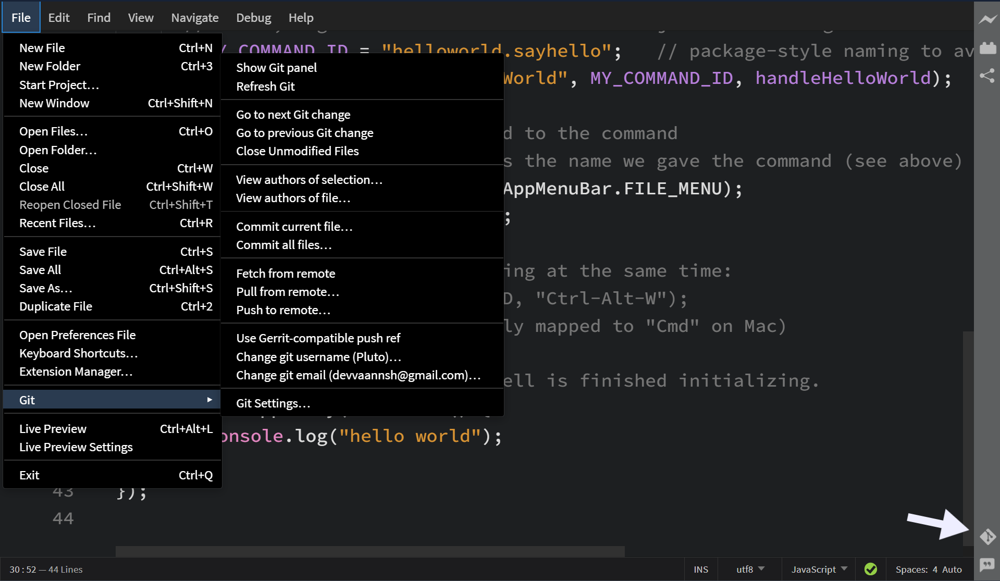

> To use Git features inside Phoenix Code, ensure Git is installed on your computer. [Download Git](https://git-scm.com/downloads)

Note: *For projects without an existing Git repository, the Git icon won’t appear by default. To initialize or connect a Git repository, use the File menu to set up Git for your project.*

The Git Panel in **Phoenix Code** provides a simple interface for managing version control. It allows you to track changes, commit updates, interact with remote repositories and many more without leaving the editor.

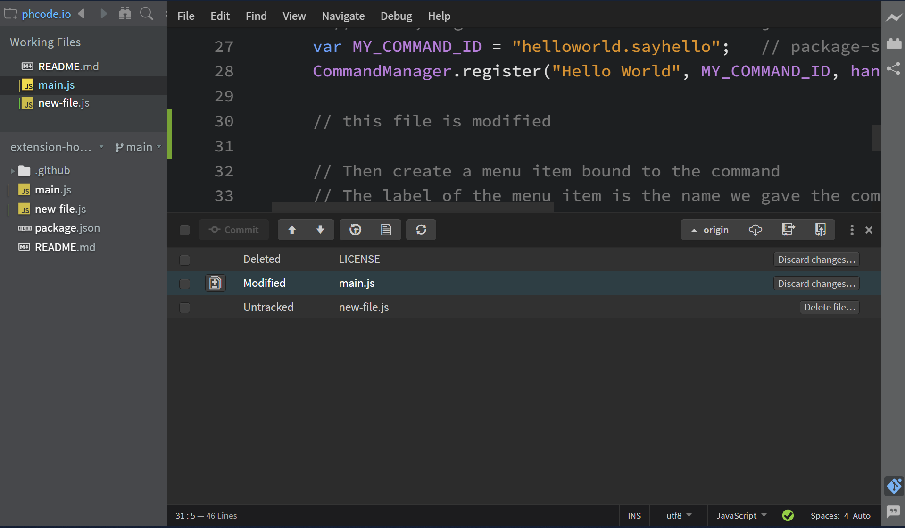

## Initializing a Git repository

To initialize a Git repository in a project that doesn’t already have one, click on `File > Git > Init`. This will set up Git for your current project. After initialization, the Git icon will appear in the toolbar, indicating that version control is active.

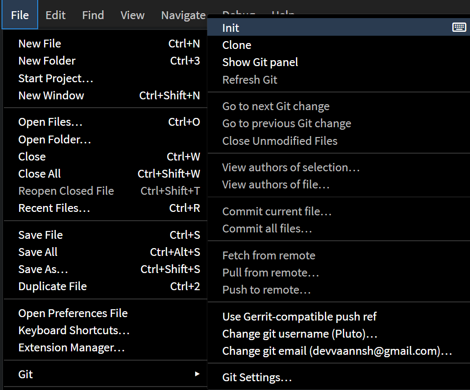

## Cloning a Git repository

You can easily clone an existing project directly within the editor.

### Suggested Method

1. Click on the `Start Project` button. 

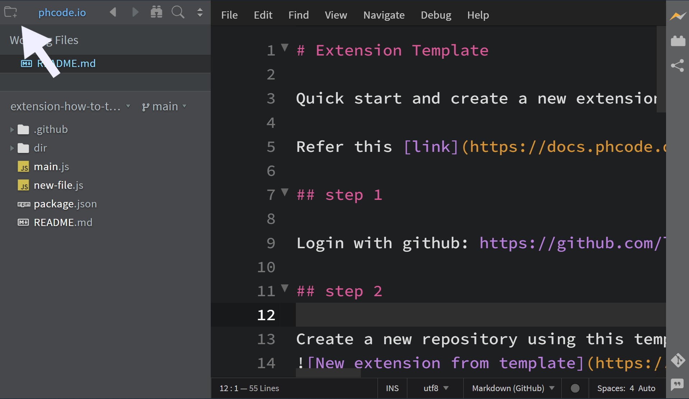

> This will open the Quick Start project dialog box, with various options. [Read more](../05-quick-start-project.md) about Quick Start project here.

2. Select the `Get from Git` button.

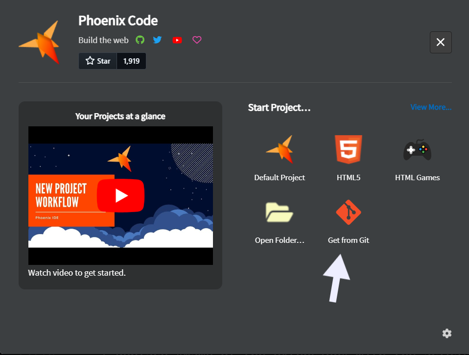

A dialog box will appear asking you to enter the `Git Clone URL` and the `Location` where you want to clone the repository. Fill in the URL of the project and select the location on your machine.

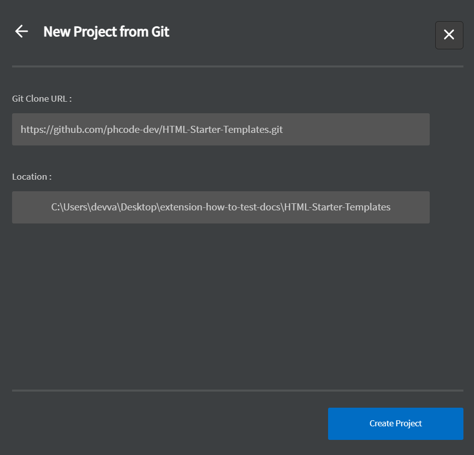

3. Click on `Create Project`. This will clone the repository to the location you specified.

### Alternative Method

Go to `File > Git > Clone`. A dialog will appear, prompting you to enter the URL of the repository you wish to clone.

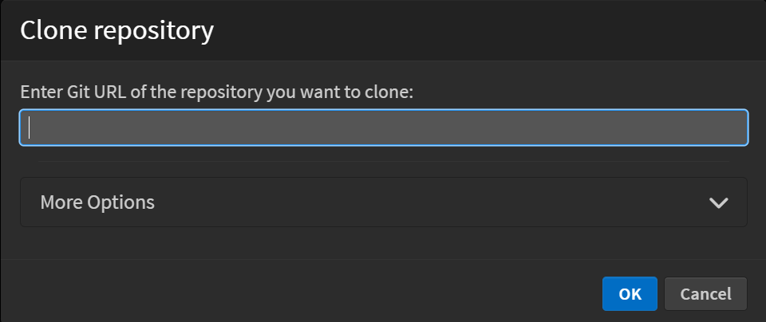

### More Options

In the Clone Repository dialog, clicking on `More Options` expands additional settings for authentication.

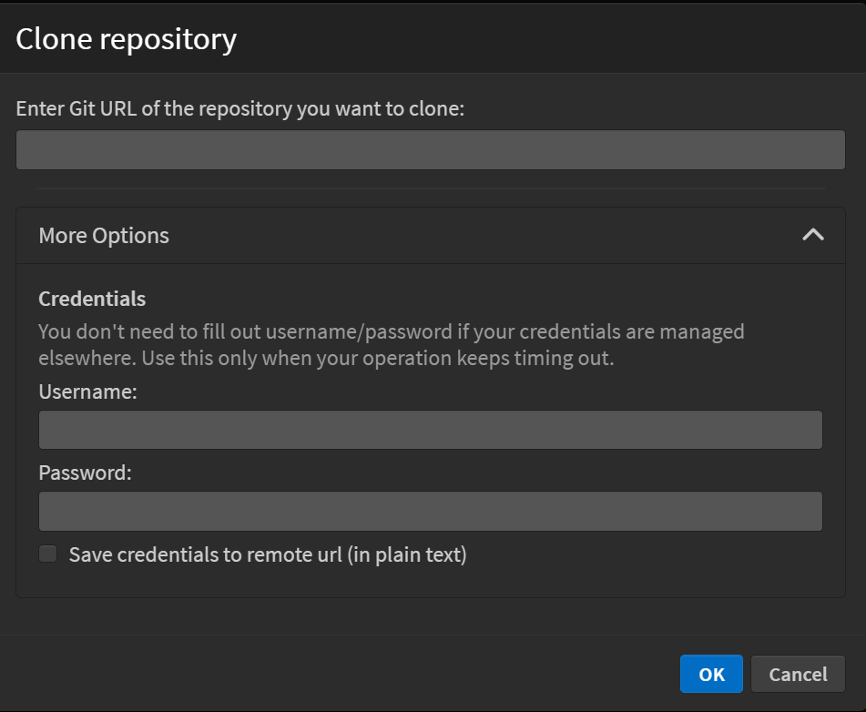

**Credentials**: This section allows you to enter your *username* and *password* for repositories that require authentication. Typically, if your credentials are already stored in a credential manager (like SSH keys or a Git credential manager), you don't need to fill in these fields.

**Save Credentials to Remote URL**: If enabled, the provided credentials (username and password) will be stored in plain text within the remote URL.

*If cloning fails due to authentication issues (e.g., timeout errors), you might need to manually provide your credentials.*

## File status

All files with changes are displayed in the Git panel along with their status, such as *Modified*, *Untracked*, and *Deleted*. For modified files, a Git diff button is available.

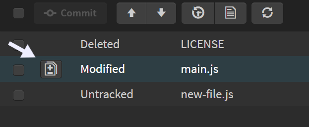

*Git diff is used to display the changes made to a file — Green lines indicate added content, while red lines show removed content.*
Clicking on the Git diff icon opens up the Git diff dialog page.

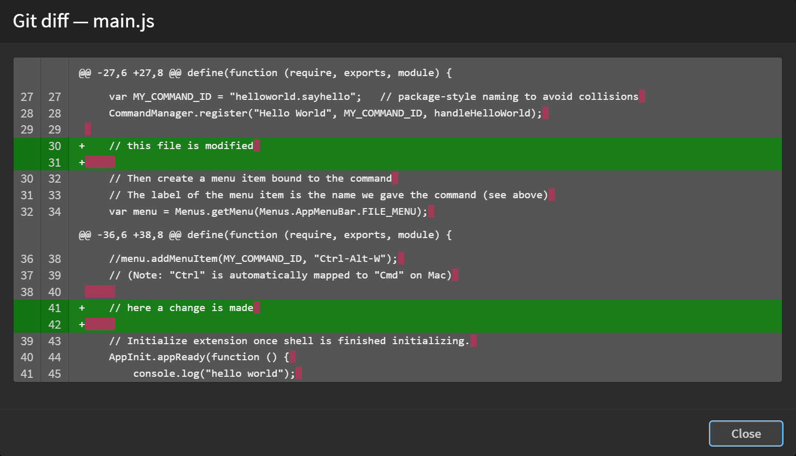

### Discard changes

For *Modified* and *Deleted* file statuses, a `Discard Changes...` button is shown. Clicking it will reset the changes for *Modified* files and restore *Deleted* files.

For *Untracked* files, a `Delete File...` button is available. Clicking it will delete the file.

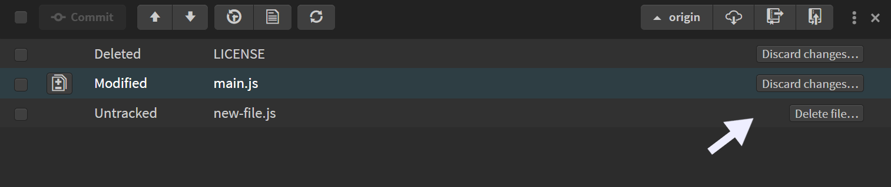

You can also discard all changes made to all files at once by clicking the three dots at the top-right and selecting the `Discard all changes since the last commit...` option. This will remove all modifications made since your last commit.

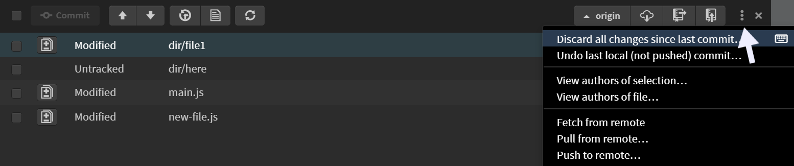

## Navigate Git Changes

When viewing a file with multiple Git changes, you can use the Next Change and Previous Change buttons to quickly move between modifications.

* **Next Change**: Moves the cursor to the next change in the file.
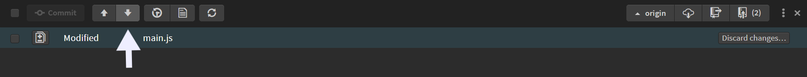

* **Previous Change**: Moves the cursor to the previous change in the file.
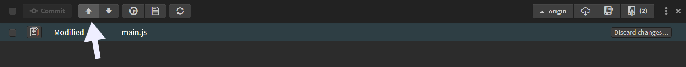

**Visual Reference**

<VideoPlayer 
  src="https://docs-images.phcode.dev/videos/git-videos/navigation-git-changes.mp4"
/>

## Refresh Panel

The **Refresh Panel** button ensures that the displayed repository information is up to date. While changes are usually updated automatically, this button helps in cases where the interface lags behind, ensuring all modifications are reflected correctly.

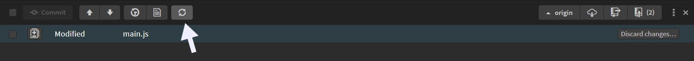

## Commit

To stage/unstage the files, click the checkbox icon at the top-left of the Git panel. This will affect all the files in the working tree. 

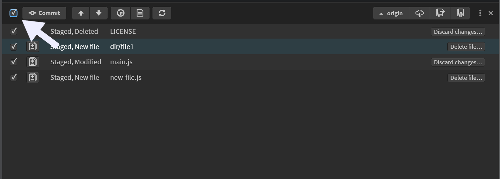

You can also stage/unstage individual files by selecting or deselecting the checkbox next to each file.

Once you get all your required files to the staging area, click on the `Commit` button.

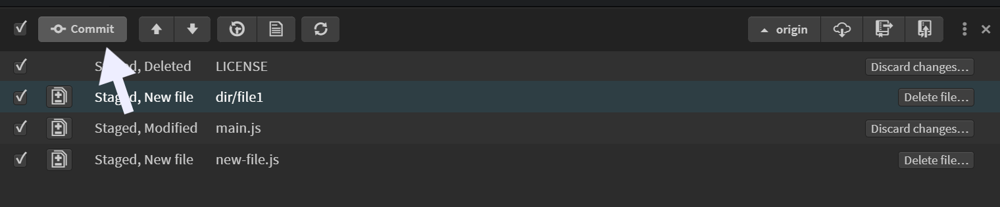
 
This will open up Git commit dialog box, which will display all the changes made to the files that are to be committed.
You can enter your commit message in the input box provided. 

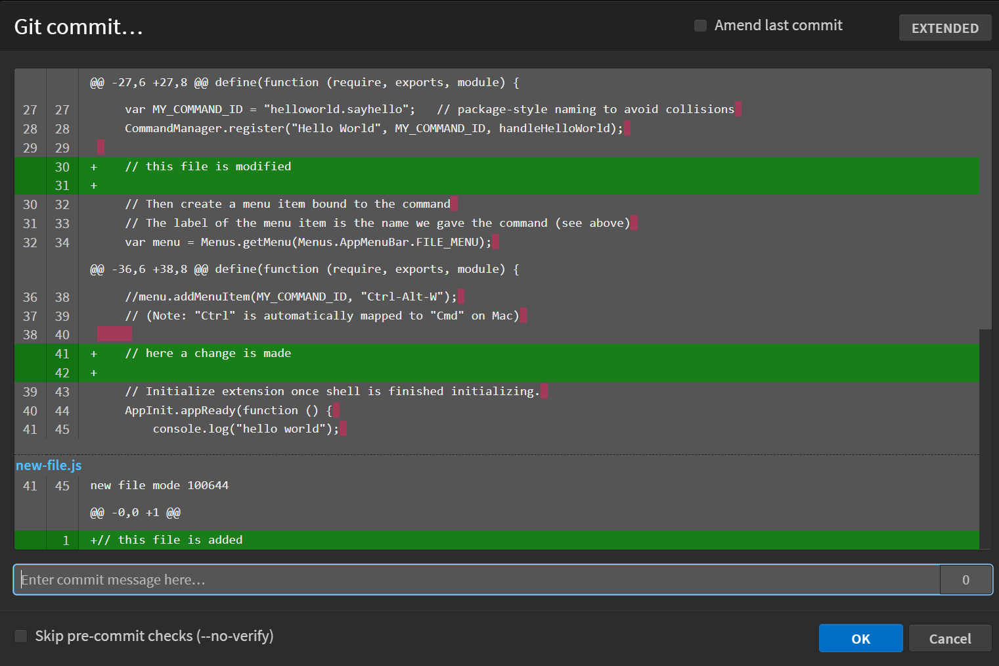

> The Commit input box also displays the number of characters in the commit message. 

*If your commit message is longer, you can use the `Extended` button at the top-right of the dialog. This expands the input area, making it easier to write detailed commit messages.*

The commit dialog box also provides options to :-
* **Amend Last Commit**: Selecting this option allows you to modify the most recent commit instead of creating a new one.
* **Skip Pre-Commit Checks**: Enabling this option bypasses any pre-commit hooks or validation steps.

> The Git commit dialog box also displays code inspection problems, if there are any:

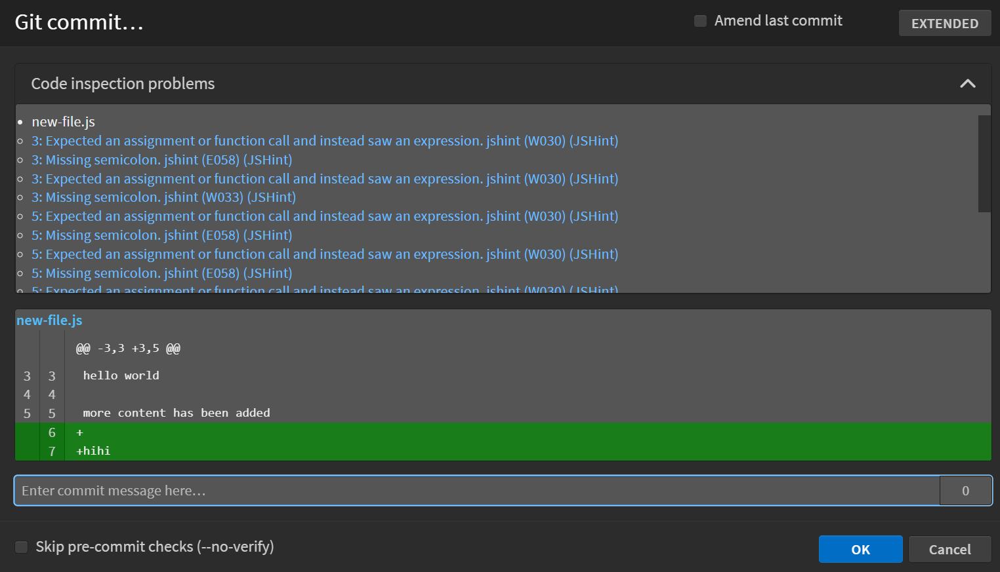

## Push

To upload your local commits to the remote repository, use the `Push` option in the Git panel. This ensures your changes are synchronized with the remote repository.

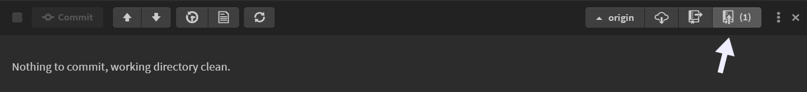

When you initiate a push, the **Push to Remote** dialog appears, allowing you to configure push settings.

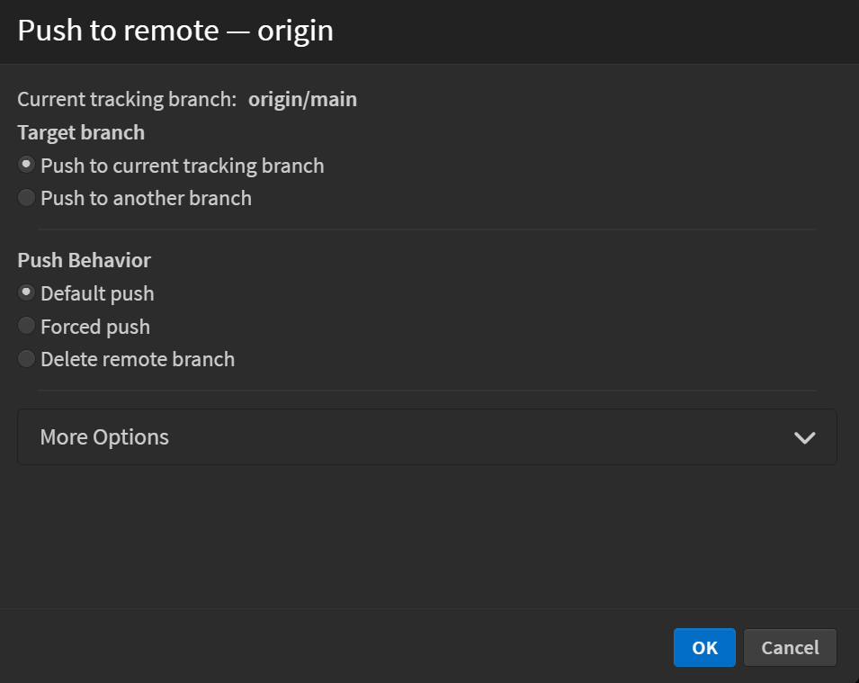

### Target Branch

* **Push to current tracking branch**: Pushes changes to the branch currently linked to your local branch.
* **Push to another branch**: Allows pushing to a different branch on the remote.

### Push Behavior

* **Default push**: Pushes your local changes to the remote branch.
* **Forced push**: Overwrites the remote branch with your local changes.
* **Delete remote branch**: Permanently removes the selected branch from the remote repository.

### More Options

Clicking More Options expands additional push settings, allowing for more control over the push operation.

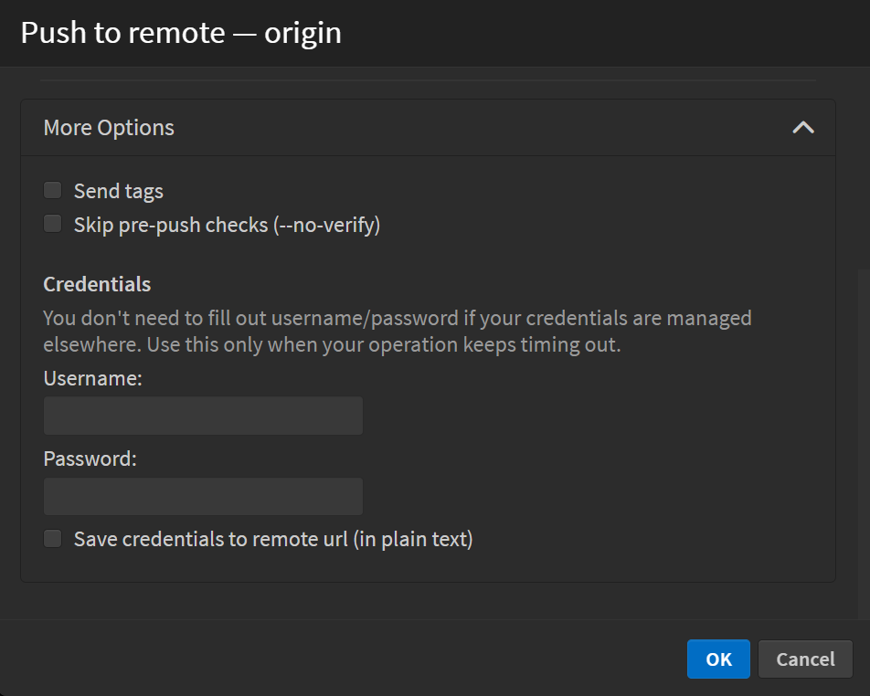

* **Send tags**: If enabled, this option ensures that Git tags are pushed along with commits. If you have created tags locally and want them reflected in the remote repository, enable this option.

* **Skip pre-push checks (--no-verify)**: Enabling this option bypasses any pre-push hooks or validation steps.

* **Credentials**: This section allows you to enter your *username* and *password* for repositories that require authentication. Typically, if your credentials are already stored in a credential manager (like SSH keys or a Git credential manager), you don't need to fill in these fields.

* **Save Credentials to Remote URL**: If enabled, the provided credentials (username and password) will be stored in plain text within the remote URL.

## Fetch

To download the latest changes from the remote repository without modifying your local repository, use the `Fetch` option in the Git panel. This will pull the latest changes from the remote repository but does not update your working directory or merge the changes into your local branches.

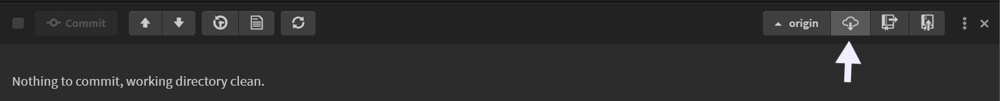

## Pull

To download the latest changes from the remote repository to your local machine, use the `Pull` option in the Git panel. This ensures your local repository is up to date with the latest changes from the remote repository.

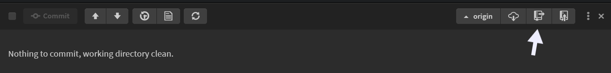

When you initiate a pull, the **Pull from Remote** dialog appears, allowing you to configure pull settings.

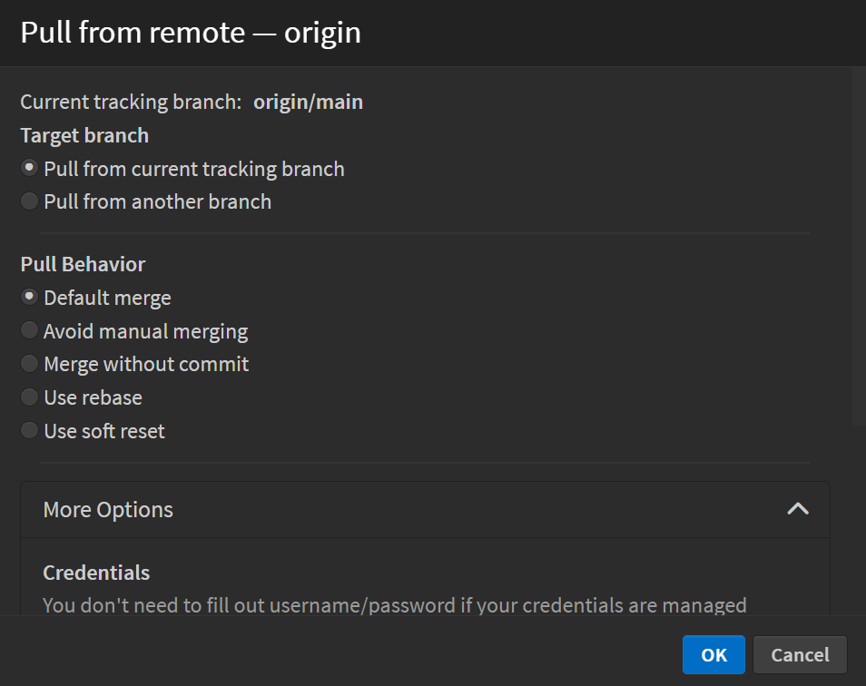

### Target Branch

* **Pull from current tracking branch**: Pulls the latest changes from the currently tracked remote branch.
* **Pull from another branch**: Allows you to pull changes from a different remote branch.

### Pull Behavior

* **Default merge**: Merges fetched changes into your current branch.
* **Avoid manual merging**: Tries to automatically resolve conflicts without manual intervention.
* **Merge without commit**: Merges changes but does not create an automatic commit.
* **Use rebase**: Applies incoming changes on top of your local commits for a cleaner history.
* **Use soft reset**: Resets to the latest remote commit without discarding local changes.

## Log (History)

**Phoenix Code** provides two options to view Git history:

### Show History

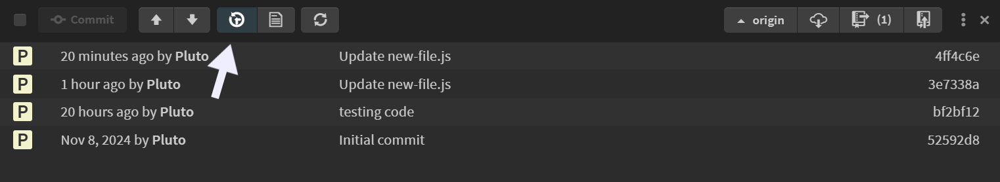
Clicking the **Show History** button displays a complete list of commits made to the entire repository to help you track the changes made to the project over time.

### Show File History

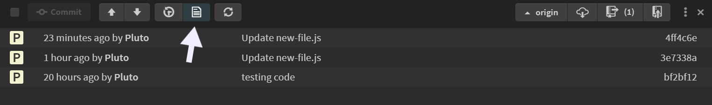
Clicking the **Show File History** button displays the commit history of a specific file, showing all modifications since it was added to the repository. 

## Branch

### Creating a new branch

To create a new branch in Git, click on the `main > Create new branch...` button in the sidebar. The name shown (e.g., main) represents your current branch, so if you're on a different branch, it may display another name.

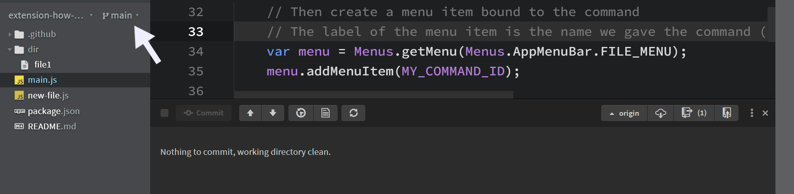

This will open a dialog box where you can:

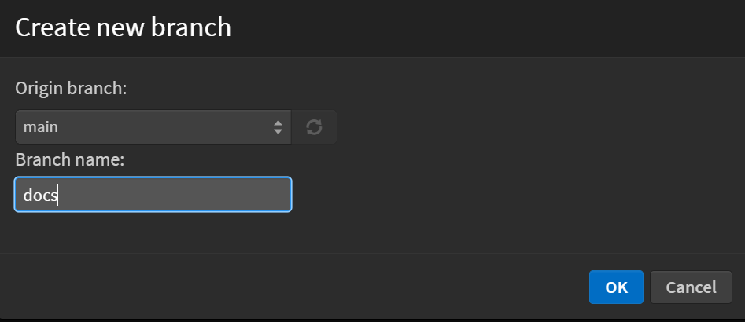
* Select the branch from which the new branch will originate.
* Enter a name for your new branch.

Once created, it automatically switches to the new branch and you can start working independently.

### Merging a branch

To merge a branch into the current branch, click on the current branch name (e.g., main) in the sidebar. This will open a popup displaying all available branches.
To the right of each branch name, you'll see a merge icon. 

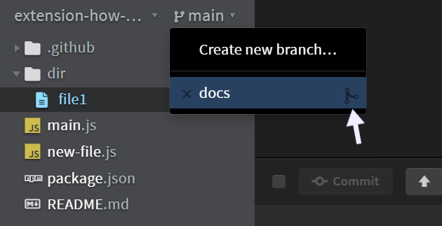

Click on this icon for the branch you want to merge.

This will open a merge dialog box with the following options:

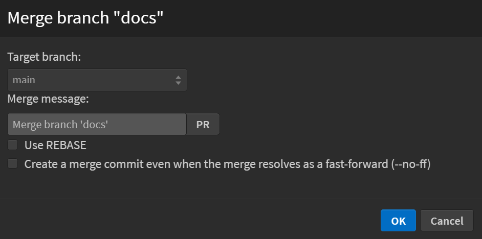

* **Target branch**: Displays the branch where the selected branch will be merged.
* **Merge message**: Provides a default message for the merge, which you can edit.
* **Use REBASE**: If checked, it rebases the commits instead of merging them.
* **Create a merge commit even when the merge resolves as a fast-forward**: If checked, it forces a merge commit even if a fast-forward merge is possible.

### Deleting a branch

To delete a local branch in Git, click on the current branch name (e.g., main) in the sidebar. This will open a dropdown menu displaying the list of all available branches.

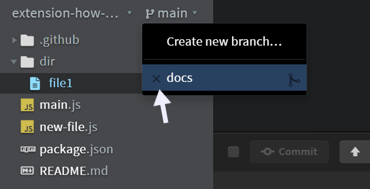

Next, hover over the branch you want to delete and click the cross 'x' icon next to it. This will delete the selected branch.

## Remote

### Adding a New Remote

To add a new remote to your Git repository, open the Git panel and click on `origin > Create new remote...`. 

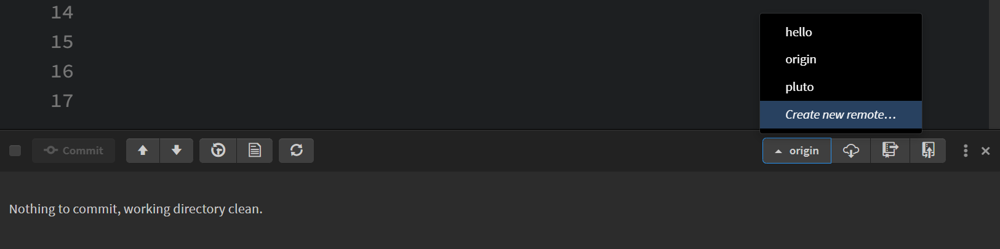

The name shown (e.g., origin) represents your current remote, so if you're on a different remote, it may display another name.

This will open a dialog box, prompting you to enter the name of the new remote.

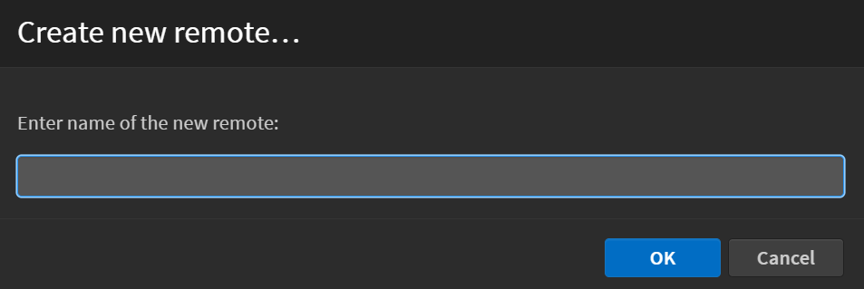
After that a new dialog box will appear, prompting you to enter the URL of the new remote.
Enter the URL and click `OK`.

This adds a new remote.

### Deleting a Remote

To delete a remote from your Git repository, click on the current remote name in the Git panel. This will open a dropdown menu displaying the list of all remotes.

Next, hover over the remote you want to delete and click the cross 'x' icon next to it. This will remove the selected remote from your repository.

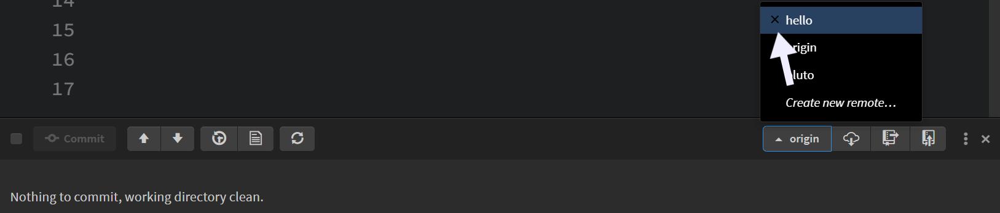

> Note: Deleting the 'origin' remote is not possible.

### Switching Between Remotes

To switch between remotes in your Git repository, click on the current remote name in the Git panel. A dropdown menu will appear showing all available remotes.

Select the remote you want to switch to, and Git will use that remote for operations like fetch, pull, or push.

## Git Menu

The Git Menu provides various Git-related actions to manage version control within the application. To access this menu, navigate to `File > Git`.

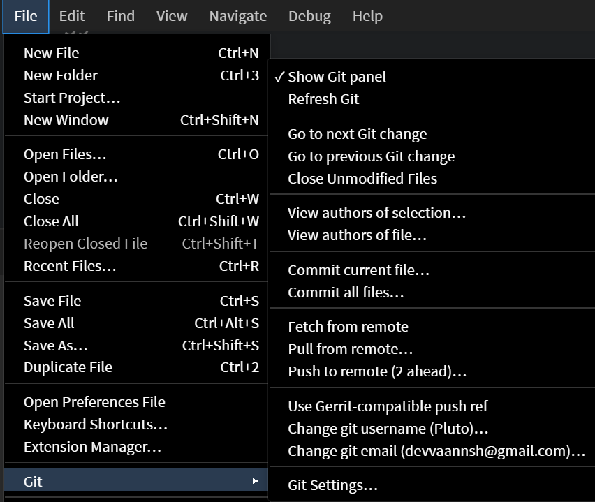

Alternatively, you can also access the Git menu by clicking the three dots in the top right corner of the Git panel.

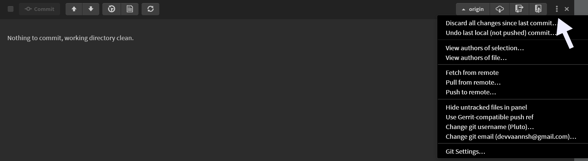

Here are the available options in Git panel: 

### General options
* **Show Git Panel**: Toggles the visibility of the Git panel in the interface.
* **Refresh Git**: Updates the Git panel to reflect the latest changes in the repository. 
[Read more](#refresh-panel) about refresh git.

### Navigation options
* **Go to Next Git Change**: Moves the cursor to the next Git-tracked change in the file.
* **Go to Previous Git Change**: Moves the cursor to the previous Git-tracked change in the file. 
[Read more](#navigate-git-changes) about navigation options.
* **Close Unmodified Files**: Closes all open files that have no uncommitted changes.

### Version history
* **View Authors of Selection...**: Displays the Git history of a selected portion of code, showing who made changes and when.
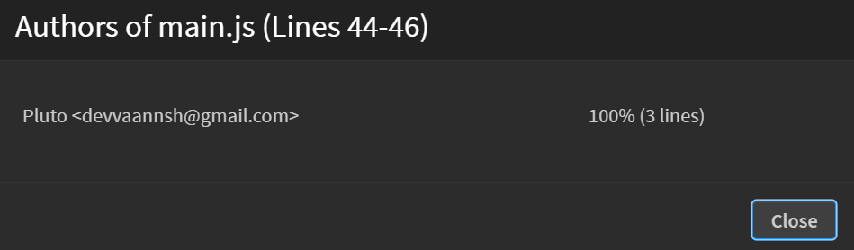
* **View Authors of File...**: Shows the commit history and contributors for the entire file.

### Committing Changes
* **Commit Current File...**: Opens a dialog to commit changes in the currently active file.
* **Commit All Files...**: Opens a dialog to commit all staged changes in the repository.

[Read more](#commit) about committing changes.

### Remote Operations
* **Fetch from Remote**: Retrieves the latest changes from the remote repository without merging them into the local branch. [Read more](#fetch) about fetching changes from remote.
* **Pull from Remote...**: Fetches and integrates changes from the remote repository into the current branch. [Read more](#pull) about pulling changes from remote.
* **Push to Remote...**: Pushes local commits to the remote repository (shows the number of commits ahead of the remote branch). [Read more](#push) about pushing changes to remote.

### Configuration
* **Use Gerrit-compatible Push Ref**: Enables push references compatible with Gerrit, a web-based code review system. [Read more](https://www.gerritcodereview.com/) about Gerrit.
* **Change Git Username...**: Allows updating the Git username for commits.
* **Change Git Email...**: Allows updating the Git email address for commits.

### Settings
* **Git Settings...**: Opens the Git Settings dialog to configure Git behavior within the application. [Read more](#git-settings) about Git settings.

## Git Settings

The Git Settings dialog provides options to configure Git behavior within the application. To open the Git Settings dialog, go to `File > Git > Git Settings...`. 

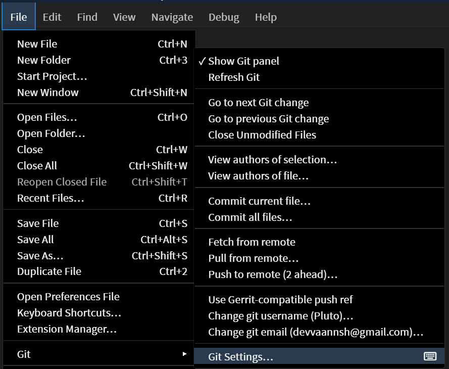

Alternatively, you can access it from the Git panel by clicking the three dots in the top right corner and selecting `Git Settings...`.

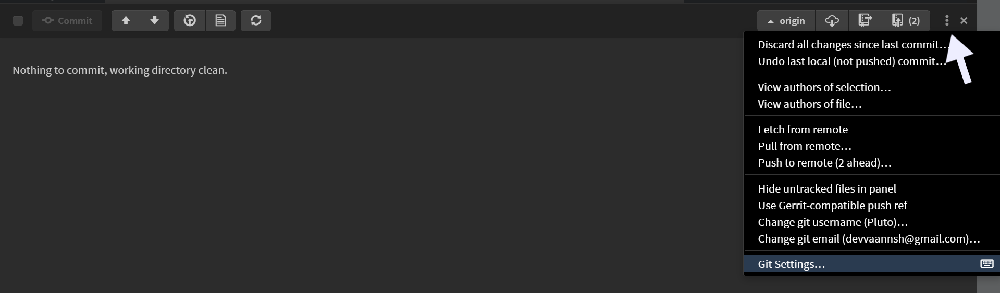

### General Settings

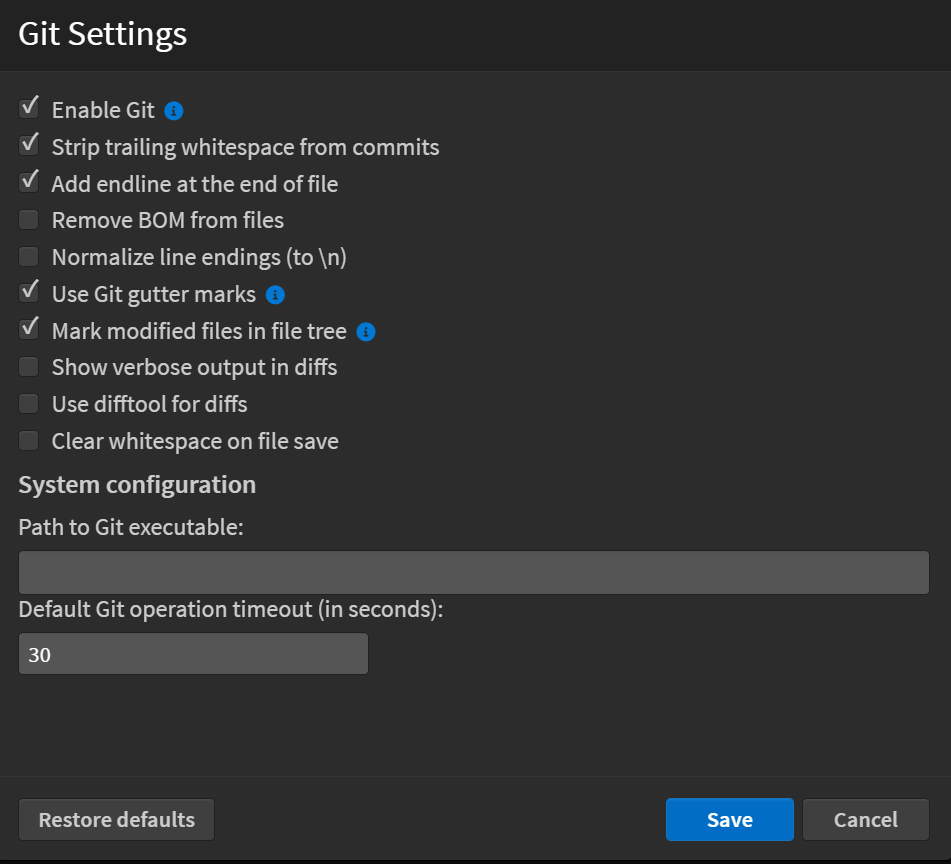

> Settings with an info icon require an application restart to take effect.

* **Enable Git**: Turns Git integration on or off.
* **Strip trailing whitespace from commits:** Automatically removes extra spaces at the end of lines when committing changes.
* **Add endline at the end of file**: Ensures a newline character is added at the end of each file.
* **Remove BOM from files**: Strips Byte Order Mark (BOM) from files to maintain consistency.
* **Normalize line endings (to \n)**: Converts different line endings (such as Windows \r\n) to Unix-style \n.
* **Use Git gutter marks**: Displays change indicators in the gutter (line numbers area) of the editor.
* **Mark modified files in file tree**: Highlights modified files in the file explorer for easy tracking.
* **Show verbose output in diffs**: Provides detailed output when viewing differences between file versions.
* **Use difftool for diffs**: Enables the use of an external diff tool for comparing changes.
* **Clear whitespace on file save**: Removes unnecessary whitespace whenever a file is saved.

### System Configuration

* **Path to Git executable**: Allows specifying a custom path to the Git installation if needed.
* **Default Git operation timeout (in seconds)**: Sets the maximum duration for Git operations before they time out (default: 30 seconds).

## FAQ

#### Q. Why is the Git icon not displayed in the Phoenix toolbar?

The Git icon does not appear in the toolbar if the project you opened is not a Git repository. It may also be missing if Git is not installed on your machine.

#### Q. Why do I get an error when trying to push changes to remote?

If you see a "Pushing to remote failed" error, it means there are new changes in the remote repository that you haven't pulled yet.

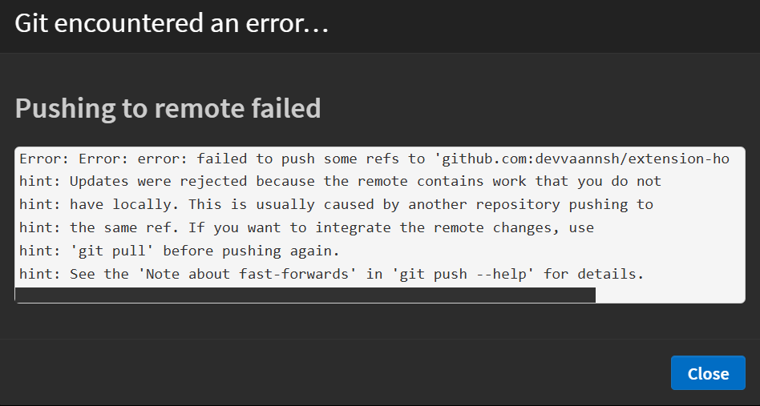

**How to Fix:**
Before pushing your changes, pull the latest updates from the remote repository. [Learn how to pull changes](#pull).

