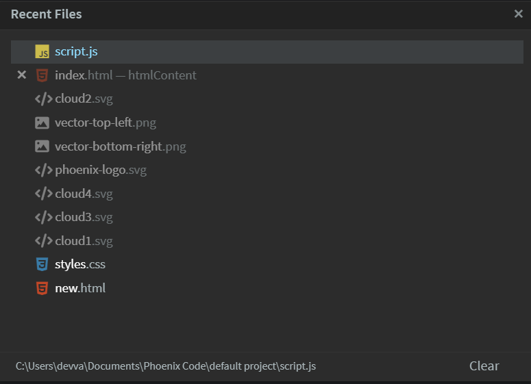

The Recent Files dialog box provides quick access to files you’ve recently worked on, allowing you to switch between them efficiently.

## Opening Recent Files
* Desktop App: Press `Ctrl + R`.
* Browser: Press `Ctrl + Alt + Shift + O` (as `Ctrl + R` is reserved for browser reloads).

To customize the keyboard shortcut, refer to [this docs](./keyboard-shortcuts#changing-a-keyboard-shortcut)

## About Recent Files Dialog

The dialog displays a list of recently opened files. Files shown in gray are not part of the **working tree** and include a cross `x` icon on the left. Clicking the icon removes the file from the **Recent Files** list.

At the bottom of the dialog, the `Clear` button removes all files from the list that are not part of the working tree.

> Files in the working tree cannot be removed directly from the recent files list. To remove these files, remove them from the working tree first.

## File Path Display

The bottom-left corner of the dialog shows the path of the currently selected file. You can also view the file path by hovering over its icon.
