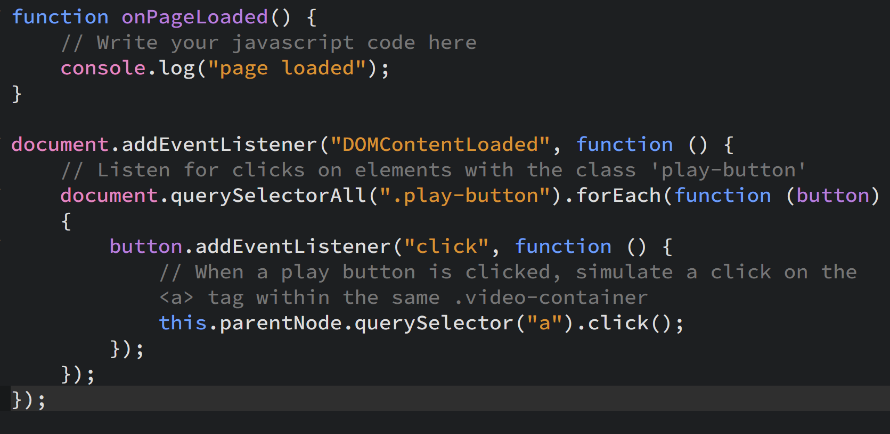

**Syntax highlighting** improves code readability by coloring different syntax elements in your code. This feature helps you quickly identify keywords, variables, and other code components, aiding in error detection and code comprehension.

## How It Works

Syntax highlighting works by analyzing the code and applying color schemes to various elements:

 * `Keywords`: Special words with predefined meanings (e.g., if, else).
 * `Strings`: Text literals enclosed in quotes.
 * `Comments`: Non-executable text, used for annotations.
 * `Variables`: Names assigned to data values.
 * `Functions`: Defined operations or methods.

Phoenix uses predefined rules for different programming languages to apply the appropriate colors.

 
Syntax Highlighting Example in a JavaScript File

## Theme Dependency

The colors used for syntax highlighting depend on the theme you are using. Themes define the color schemes for various syntax elements, allowing you to choose a style that suits your preference or needs.

Syntax Highlighting Example [Theme : `Monokai Dark Soda`]
 

Syntax Highlighting Example [Theme : `Material Color Light`]
 

To learn more about Themes. [Click Here](./themes)
   

## Add Syntax Highlighting for a Particular File Type

If you create a new file and the file type is not recognized, it will be treated as plain text by default, and no syntax highlighting will be applied. However, you can manually add syntax highlighting for the file in Phoenix.

1. Click on the **Text** Button: Locate the `Text` button in the Status Bar at the bottom of the editor.
2. Select a Language: From the dropdown list, choose the language whose syntax rules you want to apply for highlighting this file.

The file will now be treated as the selected language type, and syntax highlighting will be applied accordingly.

To learn more about **File Type Associations**. [Click Here](../03-editing-text.md#file-type-associations)

### Change Syntax Highlighting for a Particular File Type

If you need to change the syntax highlighting for an existing file:
1. Click on the **Text** Button: Click on the `Text` button in the Status Bar.
2. Select a New Language: Choose a different language from the list to change the syntax highlighting for the file.
The syntax highlighting will be updated according to the newly selected language.

## Troubleshooting

 * **No Highlighting** : Ensure that the file type is correctly recognized by the editor. Check the file extension and language mode.
 * **Incorrect Colors** : Verify your color scheme settings. You may need to adjust or switch to a different theme.
 * **Missing Language Support** : Install the necessary language extension from the editor’s marketplace.