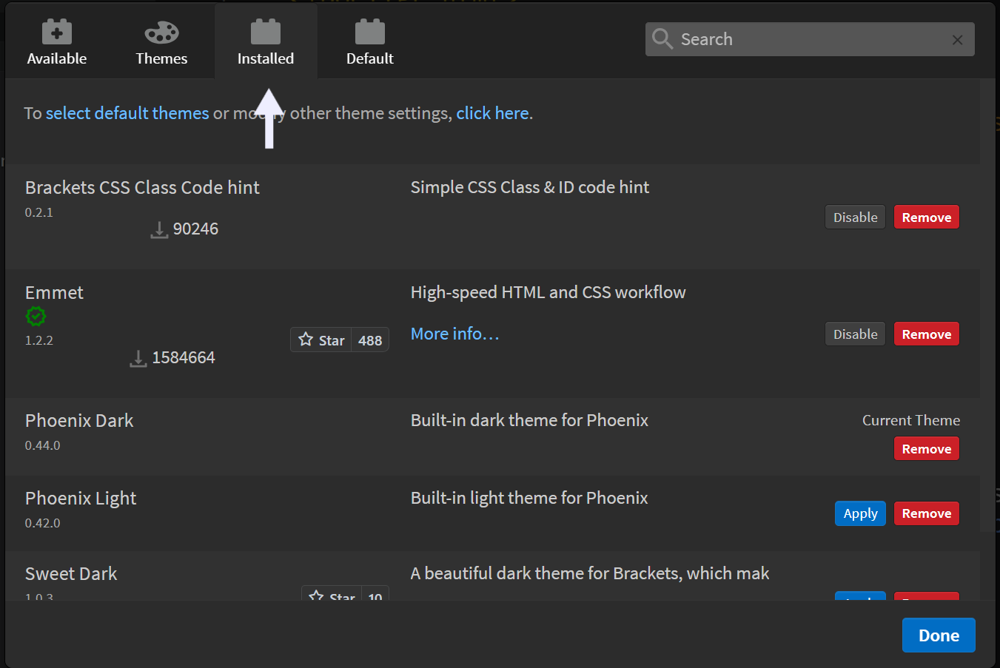
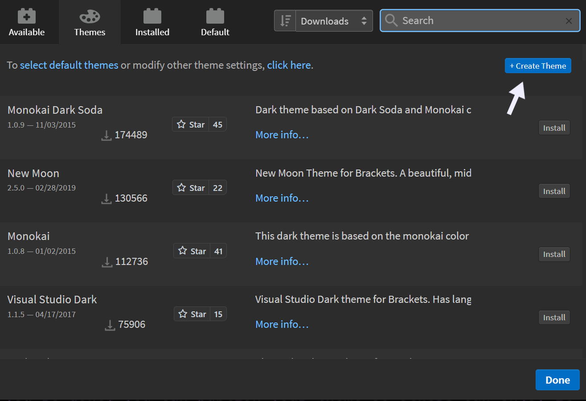
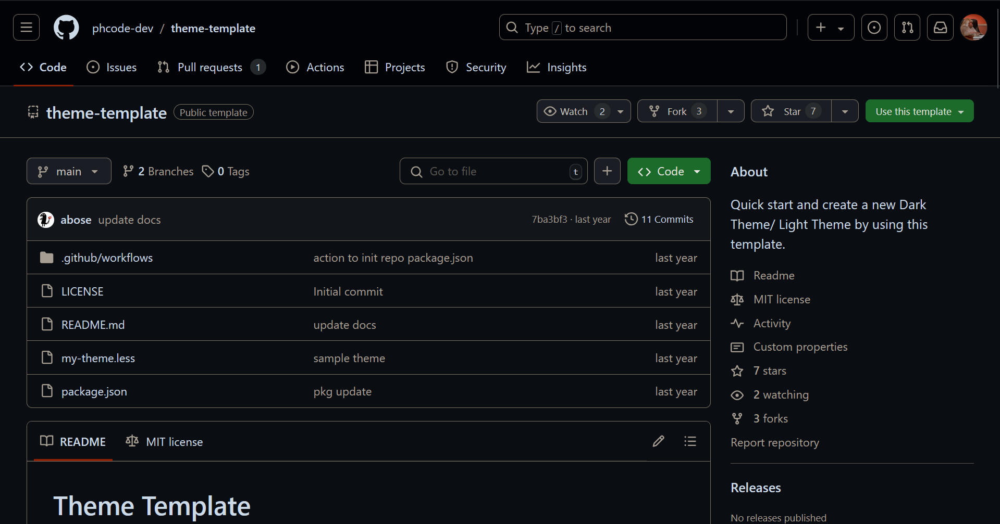

Phoenix Code provides various themes to customize your coding environment. Switching themes is straightforward and quick.

## Installing a new theme
1. Click the extension manager button on the right panel.
   
2. In the modal window, go to the Themes tab.
   
3. Browse the available themes. Choose one and click Install.
4. Confirm the installation in the popup window by clicking 'Close.'
   
   
Your new theme is now installed.

## Applying a theme
1. Click the extension manager button on the right panel.
2. In the modal window, go to the Installed tab.
   
3. Select the theme you want and click 'Apply.' Click 'Done' to finish.

The selected theme is now applied.
   

   
## Removing a theme.
To remove a theme:
1. Click the extension manager icon on the right panel.
2. In the modal window, go to the Installed tab.
3. Find the theme you want to remove and click 'Remove.'
4. Confirm by clicking 'Remove Extensions and Reload' in the popup window.
   

The theme is now removed.

## Creating your own theme.
If you want a custom theme, follow these steps:
1. Click the extension manager icon on the right panel.
2. In the modal window, go to the Themes tab.
3. Click 'Create Theme' in the top right corner.
   
4. You’ll be redirected to Phoenix Code’s official Theme Template repository.
   
5. Use the template to create your theme.
6. Publish your theme to use it and share it with others.
