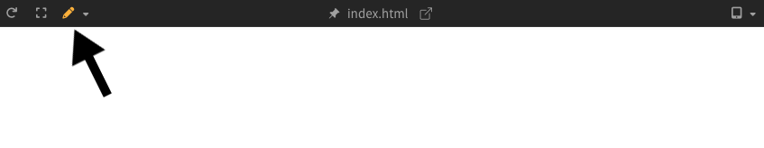
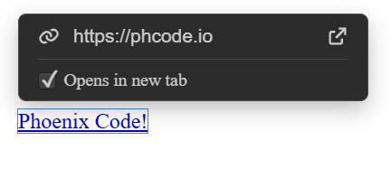
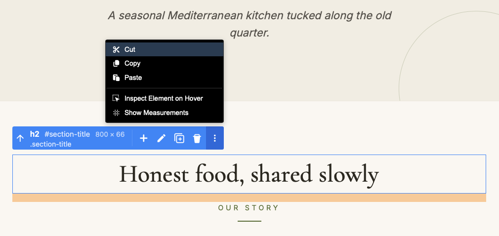

import React from 'react';
import VideoPlayer from '@site/src/components/Video/player';

:::info Pro Feature
[Upgrade to Phoenix Code Pro](https://phcode.io/pricing) to access this feature.
:::

**Edit Mode** lets you modify your page directly in the Live Preview. You can edit text, change element tags, update classes and IDs, insert new elements, rearrange them with drag and drop, swap images, edit links, and much more.  
**Phoenix Code** updates your source code automatically as you make changes.

<VideoPlayer
  src="https://docs-images.phcode.dev/videos/live-preview-edit/live-preview-edit.mp4"
/>

---

## Enabling Edit Mode

To switch to Edit Mode, click the **mode selector dropdown** in the Live Preview toolbar and select **Edit Mode**.



Alternatively, you can switch to Edit Mode by updating the `livePreviewMode` setting in the preferences file. See [Editing Preferences](../editing-text#editing-preferences) to learn how to edit the preferences file.

---

## Control Box

When you click an element in the Live Preview, a **Control Box** appears near it. This floating panel shows you what the element is and gives you tools to edit it.

<!-- Add an image here showing the Control Box with the info section and tools section visible -->

> The Control Box is shown only for editable elements. It is not shown for non-editable elements that are dynamically created by JavaScript.

### Element Info

The left side of the Control Box displays information about the selected element:
- **Tag name**: The element type (for example, `div`, `p`, `img`)
- **ID**: The element’s ID attribute (if present), shown with a `#` prefix
- **Dimensions**: The element’s size in pixels (width × height)
- **CSS classes**: The element’s classes, shown with a `.` prefix. If the element has more than three classes, only the first three are shown, followed by a “+N more” indicator

<!-- Add an image here showing the info section of the Control Box with tag name, ID, dimensions, and classes -->

Clicking on the info section opens the [Element Properties](#edit-element-properties) editor, where you can edit the element’s tag name, classes, and ID.

### Select Parent

The **Select Parent** button *(up-arrow icon)* appears next to the info section. Clicking it selects the parent of the currently selected element.

> This button appears only when a valid parent exists. It is not shown when the parent is `body`, `html`, or a JavaScript-rendered element.

### Tools

The right side of the Control Box displays a set of tools you can use to modify the selected element. The available tools depend on the element type. Some buttons are shown for all elements, while others appear only for specific element types.

<!-- Add an image here showing the tools section of the Control Box -->

- **Insert Element** *(plus icon)*: Opens a panel where you can insert a new HTML element before, after, or inside the selected element.  
  *This option is available for all elements.*  
  See the [Insert Element](#insert-element) section for more details.

- **Edit Hyperlink** *(chain icon)*: Opens a panel that lets you edit the element’s `href` attribute.  
  *This button appears only for `<a>` elements.*  
  See the [Edit Hyperlink](#edit-hyperlink) section for more details.

- **Change Image** *(image icon)*: Opens an image gallery at the bottom of the Live Preview, where you can browse and select an image. You can also choose an image from your computer. Phoenix Code automatically saves the image to your project folder and updates the `src` attribute of the element.  
  *This button appears only for `` elements.*  
  See [Image Gallery](./02-image-gallery.md) for more details.

- **Edit Text** *(pen icon)*: Opens inline text editing for the selected element. You can edit text directly in the Live Preview, and Phoenix Code automatically updates the source code.  
  *This button appears only for elements that can contain text (it is not available for ``, `<video>`, `<br>`, etc.).*  
  See the [Inline Text Editing](#inline-text-editing) section for more details.

- **Duplicate** *(copy icon)*: Copies the selected element and places it below. You can also duplicate elements using `Ctrl/Cmd + D` after clicking an element.  
  *This option is available for all elements.*

- **Delete** *(trash icon)*: Deletes the selected element. You can also delete elements using the `Delete` key after clicking an element.  
  *This option is available for all elements.*

- **More Options** *(three-dots icon)*: Opens a menu with additional actions. You can also open this menu by right-clicking anywhere in the Live Preview, but only in Edit Mode.  
  *This option is available for all elements.*  
  See [Cut, Copy, and Paste](#cut-copy-and-paste) for more details.

---

## Hover Box

The **Hover Box** is a small tooltip that appears when you hover over an element in Edit Mode. It shows an icon and a label that describe the element type (for example, “Image”, “Button”, “Container”, “Paragraph”).

<!-- Add an image here showing the Hover Box tooltip on an element -->

The Hover Box helps you quickly identify elements as you move your cursor over the page, without needing to click on them.

> The Hover Box uses a different color for editable and non-editable elements. Standard HTML elements appear in blue, while dynamically created (JavaScript-rendered) elements appear in gray.

---

## Inspect Element on Hover

By default, in Edit Mode, hovering over elements in the Live Preview highlights them and displays the [Hover Box](#hover-box). You can change this behavior to show highlights only when you click elements instead.

To toggle this setting, click the **mode selector dropdown** in the Live Preview toolbar and unselect **Inspect Element on Hover**. By default, this option remains checked.

<!-- Add an image here showing the Inspect Element on Hover option in the mode selector dropdown -->

When **Inspect Element on Hover** is checked (default):
- Hovering over elements shows highlights and the Hover Box
- Clicking an element selects it and displays the Control Box

When **Inspect Element on Hover** is unchecked:
- Hovering over elements has no effect
- Clicking an element shows highlights and the Control Box

Alternatively, you can change this setting by updating the `livePreviewInspectElement` preference in the preferences file. Set it to `”hover”` (default) or `”click”`.  
See [Editing Preferences](../editing-text#editing-preferences) to learn how to edit the preferences file.

---

## Edit Element Properties

The **Element Properties** panel lets you edit an element's tag name, ID, classes, and other HTML attributes directly from the Live Preview. All changes are synced to your source code in real-time, and code hints appear as you type to help you pick the right values.

To open the panel, click on the **info section** (the left side showing the tag name, ID, and dimensions) of the [Control Box](#control-box).

<!-- Add an image here showing the Element Properties panel with the tag, ID, classes, and attributes sections -->

The panel has four sections:

- **Tag**: Change the element type (for example, turn a `div` into a `section`). You can type directly or click the **dropdown arrow** to browse a list of common HTML tags.
- **ID**: Change or remove the element's ID.
- **Classes**: Existing classes are shown as chips with a **×** button to remove them. Click **+** to add new classes. You can type multiple class names separated by spaces.
- **Attributes**: All other HTML attributes are shown as editable name-value pairs. Click **+** to add a new attribute, or **×** to remove one.

<!-- Add an image here showing the classes section with a few class chips and the add class input -->

To undo all changes made in the panel, click the **Reset** button in the panel header. This reverts the element to the state it was in when you first opened the panel.

---

## Inline Text Editing

The **Inline Text Editing** feature lets you modify text content directly in the Live Preview, with all changes automatically synced to the source code.

To start editing, **double-click** an element in the Live Preview or click the **Edit Text** button *(pen icon)* in the Control Box.  
Edit the text as needed, then press `Enter` to save or `Esc` to cancel.  
To insert a line break, press `Shift + Enter`.

> Text editing is available only for elements that can contain text. It is not supported for elements such as ``, `<video>`, `<br>`, and similar non-text elements.

### Formatting Toolbar

When you start editing text, a **Formatting Toolbar** appears near the element. It gives you quick access to common text formatting options.

<!-- Add an image here showing the Formatting Toolbar with the B, I, U buttons and the more button -->

Select the text you want to format and click a formatting button, or use the keyboard shortcut. If no text is selected, the formatting is applied to the entire element. Clicking a format that is already applied removes it.

The toolbar shows three primary formatting buttons:
- **Bold** (`Ctrl/Cmd + B`): `<b>` tag
- **Italic** (`Ctrl/Cmd + I`): `<i>` tag
- **Underline** (`Ctrl/Cmd + U`): `<u>` tag

#### More Formatting Options

Click the **More** button *(three-dots icon)* on the right side of the toolbar to see additional formatting options:
- **Strikethrough**: `<s>` tag
- **Subscript**: `<sub>` tag
- **Superscript**: `<sup>` tag
- **Code**: `<code>` tag

<!-- Add an image here showing the More formatting dropdown with Strikethrough, Subscript, Superscript, and Code options -->

<VideoPlayer
  src="https://docs-images.phcode.dev/videos/live-preview-edit/inline-text-editing.mp4"
/>

---

## Image Gallery

The **Image Gallery** lets you browse and select images from online image providers or your device and use them in your project directly.

[Read More](./image-gallery)

---

## Drag and Drop

The **Drag and Drop** feature lets you reposition elements in the Live Preview by dragging them to a new location. The source code is automatically updated with the new structure when you drop the element.

To drag an element: click and hold the element, then move your mouse to the desired location. The element becomes semi-transparent while dragging. As you hover over potential drop targets, Phoenix Code displays visual indicators showing where the element will be placed.

#### Visual Indicators
- **Arrow markers** to indicate the drop position:
    - **Up (↑) or Down (↓) arrows**: Places the element before or after the target element
    - **Left (←) or Right (→) arrows**: Places the element before or after the target element (appears for flex row layouts)
    - **⊕ symbol with a dashed border**: Places the element inside the target as a child

- **Target label**: A small box next to the marker displays the target element's tag name, ID, and classes

> When multiple drop targets overlap *(for example, an `img` inside a `div` with aligned edges)*, you can scroll slightly to cycle through targets and drop the element when the correct label appears.

Phoenix Code validates drops to prevent invalid HTML structure. *For example, list items can only be placed inside list containers, and block elements cannot be placed inside inline elements*. If a drop location is invalid, Phoenix Code shows the marker for the closest valid drop target. In some cases, when no valid drop target is found, Phoenix Code won't show any indicators.

To cancel a drag, press `Esc`.

> When you drag an element near the top or bottom edge of the viewport, the Live Preview automatically scrolls in that direction.

<VideoPlayer
  src="https://docs-images.phcode.dev/videos/live-preview-edit/drag-drop.mp4"
/>

---

## Edit Hyperlink

The **Edit Hyperlink** feature lets you modify the URL and behavior of anchor (`<a>`) elements directly in the Live Preview.

To edit a hyperlink, select an `<a>` element and click the **Edit Hyperlink** button *(chain icon)* in the Control Box. An editing panel appears near the element.

The input box includes:
- **URL input**: Edit the link's destination (`href` attribute). Press `Enter` to save your changes or `Esc` to cancel.
- **Opens in new tab**: Check this option to make the link open in a new tab. Checking this option will add `target="_blank"` in your source code.
- **Open this link**: Clicking on this button opens the URL in your default browser. This option is available only in desktop apps.



---

## Measurements

The **Measurements** feature displays ruler lines from the edges of a selected element to the document edges, showing exact pixel positions.

[Read More](./measurements)

---

## Cut, Copy, and Paste

You can cut, copy, and paste elements in Edit Mode using standard keyboard shortcuts or the Control Box **More Options** menu *(three-dots icon)*.

### Using Keyboard Shortcuts

When you click an element in the Live Preview, keyboard focus moves to the Live Preview. You can then use:
- **Ctrl/Cmd + X**: Cut the selected element
- **Ctrl/Cmd + C**: Copy the selected element
- **Ctrl/Cmd + V**: Paste the copied or cut element below the currently selected element

### Using the More Options Menu


Click the **More Options** button *(three-dots icon)* in the Control Box and select **Cut**, **Copy**, or **Paste** from the dropdown menu.

> Keyboard shortcuts apply to elements only when focus is in the Live Preview. When editing source code, the shortcuts affect the code instead.

---

## Undo and Redo

You can undo and redo changes made in Edit Mode using keyboard shortcuts:

- **Ctrl/Cmd + Z**: Undo the last change
- **Ctrl/Cmd + Y** or **Ctrl/Cmd + Shift + Z**: Redo the last undone change

These shortcuts work for all Edit Mode operations, including text edits, element moves, deletions, and other modifications.

---

## Quick Preview Toggle

A **Quick Preview Toggle** button is available at the top center of the Live Preview. It lets you quickly switch to Preview Mode and back to the previously selected mode (Highlight Mode or Edit Mode). This is especially useful when working with a popped-out Live Preview window. You can also use the `F8` keyboard shortcut to toggle Preview Mode.

<VideoPlayer
  src="https://docs-images.phcode.dev/videos/live-preview-edit/quick-preview-toggle.mp4"
/>

The button is partially visible as a thin strip at the top edge of the Live Preview. Moving your cursor over this strip reveals the full button, which you can click to toggle Preview Mode.

---

## Disabling Edit Mode for Specific Elements

If you have interactive elements (like navigation menus, modals, or carousels) that need to respond to clicks normally, you can exclude them from Edit Mode behavior.

Add the `phcode-no-lp-edit` class to any element you want to behave normally:

```html
<div class="phcode-no-lp-edit">
    <!-- Clicks and interactions inside this element work normally -->
</div>
```

When an element has this class, the element behaves as if you're in Preview Mode.
> This also applies to all child elements inside the marked element.

If you want only to exclude the particular element and not its children, use the class `phcode-no-lp-edit-this`.

> Placing your cursor on the element in the source code will still highlight it in the Live Preview. To use edit features, click the element directly in the Live Preview.

---