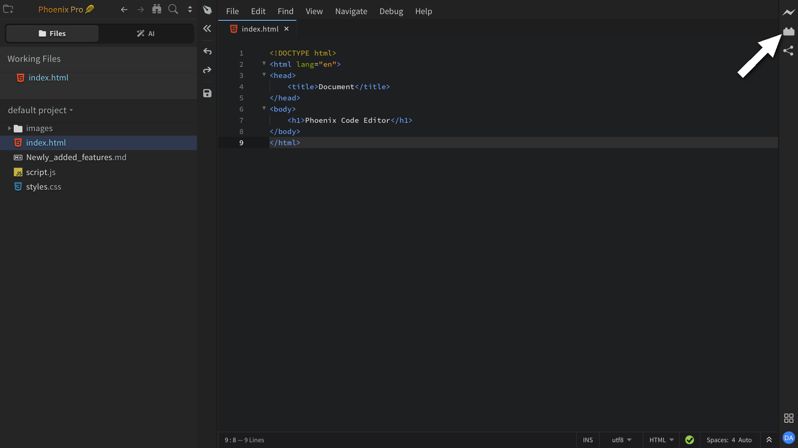
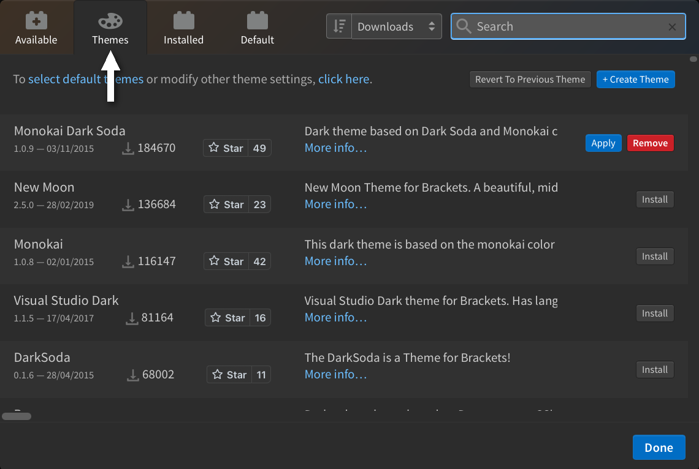

import React from 'react';
import VideoPlayer from '@site/src/components/Video/player';

Phoenix Code supports extensions for adding features, themes, and language support. Everything is managed through the built-in **Extension Manager**.

To open the Extension Manager, click the extension icon on the right-hand toolbar, as shown below.

The dialog has four tabs:

| Tab | Contents |
| --- | --- |
| **Available** | Marketplace extensions. A search box at the top filters the list. |
| **Themes** | Marketplace themes. |
| **Installed** | Everything you've installed. Apply, update, or remove from here. |
| **Default** | Built-in extensions that ship with Phoenix Code. |

A **Sort** dropdown at the top of the dialog orders the list by **Last Updated** (most recently published first), **Downloads** (most-installed first), **Star Rating** (highest GitHub stars), or **Verified** (Phoenix-verified extensions first).

<VideoPlayer src="https://docs-images.phcode.dev/videos/extensions/extension-manager.mp4" />

- **Install**: pick an item from **Available** or **Themes** and click **Install**.
- **Update**: when a newer version is available, an **Update** button appears on the extension's card in **Installed**.
- **Remove**: click **Remove** on the card in **Installed**, then confirm with **Remove Extensions and Reload**.

## Themes

Themes use the same flow under the **Themes** tab.

To switch to an installed theme, either pick it from `View > Themes...` (see [Customizing the Editor → Themes](./customizing-editor#themes)) or click **Apply** next to the theme in **Installed**.

## Create your own

For authoring extensions and themes, see the API section:

- [Creating Themes](/api/creating-themes)
- [Creating Extensions](/api/creating-extensions)
- [Creating Node Extensions](/api/creating-node-extensions)
- [Debugging Extensions](/api/debugging-extensions)
- [Publishing Extensions](/api/publishing-extensions)

## Popular Extensions

For a curated list of community extensions worth checking out, see [Popular Extensions](./popular-extensions).
