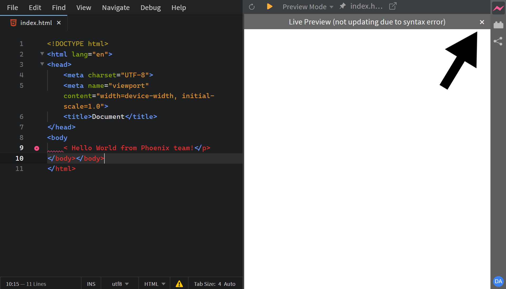
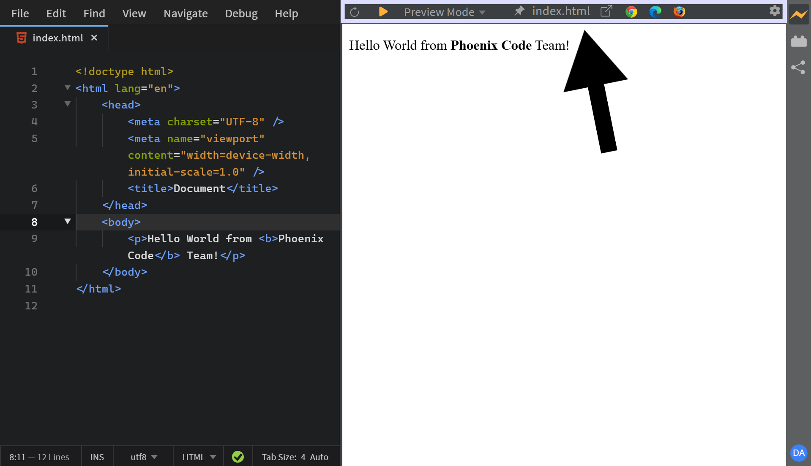
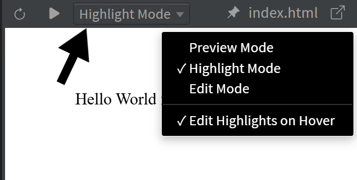
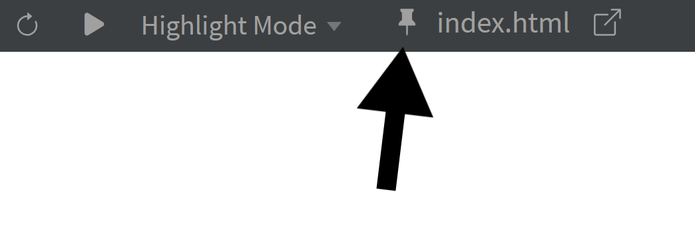
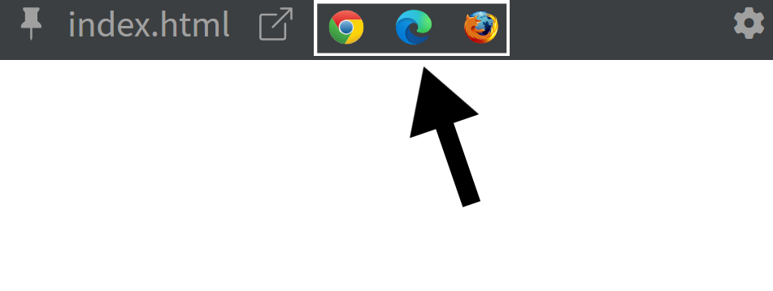
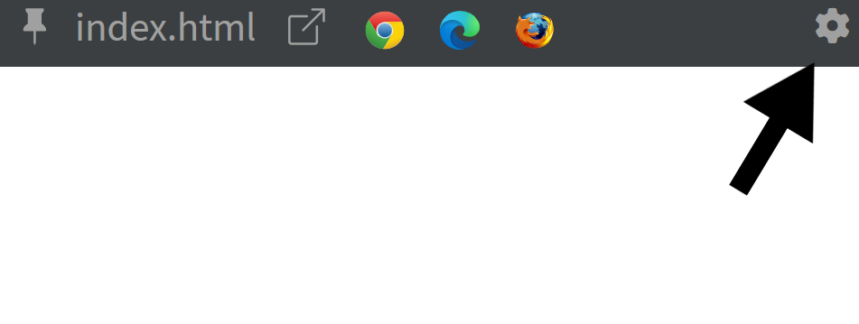

import React from 'react';
import VideoPlayer from '@site/src/components/Video/player';

The **Live Preview** feature in **Phoenix Code** provides instant feedback on changes made to **HTML** and **CSS** files, letting you see your edits in real-time.

> For HTML files, Live Preview is enabled by default. For other file types, you might need to do some manual setup.

---

## Showing or Hiding Live Preview

To show or hide Live Preview, click the **Lightning Bolt** icon at the top of the right toolbar.

> This button toggles the visibility of the Live Preview panel.

Alternatively, toggle from `File > Live Preview` or use the keyboard shortcut (default: `Ctrl + Alt + L` on Windows/Linux, `Cmd + Alt + L` on macOS).

To customize the keyboard shortcut, see the [Keyboard Shortcuts Guide](../keyboard-shortcuts).

---

## Understanding the Bolt Icon

The Live Preview bolt icon appears in different colors, each indicating a different status:

* **Gray bolt**: Live Preview is currently turned off.

* **Half yellow bolt**: Live Preview is connecting.

* **Full yellow bolt**: Live Preview is successfully connected. Changes will now appear in real-time.

* **Pink bolt**: There is a syntax error in your code. Live Preview is not updating because of that.

> You can also hover over the bolt icon to see a tooltip showing the current status.

<!-- @devansh - commenting this out for now because we are not shipping status overlays -->
<!-- ### Status Overlays

When there's a syntax error, the bolt icon turns pink and Phoenix Code also displays an overlay in Live Preview stating that there is an error.

You can close this overlay by clicking the `×` icon and the overlay won't appear again.

Phoenix Code also displays a connecting overlay while Live Preview is establishing a connection.

 -->
---

## Live Preview Toolbar

Phoenix Code provides various options in the Live Preview toolbar.

> The browser icons and settings button are hidden by default and appear only on hover.

### Toolbar Options

* **Reload Live Preview** — Refreshes the Live Preview page. Use this when Live Preview lags behind or doesn't update with your code changes.

--- 

* **Live Preview Modes** - Live Preview offers 3 modes:

  - **Preview Mode**: View-only. The page behaves like a normal browser, but still updates in real-time as you edit code.

  - **Highlight Mode**: Click any element to see its size, padding, and margins. Phoenix Code jumps to that element in your source code so you can start editing right away.

  <VideoPlayer
    src="https://docs-images.phcode.dev/videos/live-preview/highlight-mode.mp4"
  />

  - **Edit Mode** *(Pro)*: Edit elements directly in the preview-change text, drag elements, swap images, and more. Phoenix Code updates your source code automatically. [Learn more](../../Pro%20Features/live-preview-edit).

--- 

<VideoPlayer
  src="https://docs-images.phcode.dev/videos/live-preview/preview-mode-btn.mp4"
/>

* **Preview Mode Button** — Located next to the Reload button, this provides a quick shortcut to switch modes.  
  Clicking the button switches to **Preview Mode**. On **Phoenix Pro Edition**, a second click returns to **Edit Mode**. On **Phoenix Community Edition**, a second click switches to **Highlight Mode**.  
  You can also use the keyboard shortcut `F8` to toggle Preview Mode.

---

* **Pin or Unpin Preview Page** — Pin a file in Live Preview so it remains displayed even when you switch to other files. Click again to unpin.

---

* **File Name** — Displays the name of the currently previewed file. Click it to open that file in the editor (if not already open).

---

* **Pop Out to New Window** — Opens Live Preview in your default browser. This is helpful when you want to see how your page looks in a full browser window.

---

* **Browser Icons** — Select a specific browser icon to open the page in that browser. This helps you see how your page looks across different browsers. The icons are hidden by default. You need to hover over the toolbar to reveal them.
  > This option is available only in Desktop apps.

---

* **Live Preview Settings** — Located at the right-most side of the toolbar. [Read more about Live Preview Settings](./live-preview-settings/#accessing-live-preview-settings).

---

## Using Live Preview with HTML Files

1. Open the HTML file you want to preview.
2. Click the **Lightning Bolt** icon to open Live Preview (if it's closed).
3. Make changes to the HTML file and see them update in Live Preview in real-time.

> If changes don't appear, reload Live Preview and wait until the bolt icon turns full yellow.

---

## Live Preview Demonstrated

<VideoPlayer
  src="https://docs-images.phcode.dev/videos/phcode.io-site/live_preview.mp4"
/>

