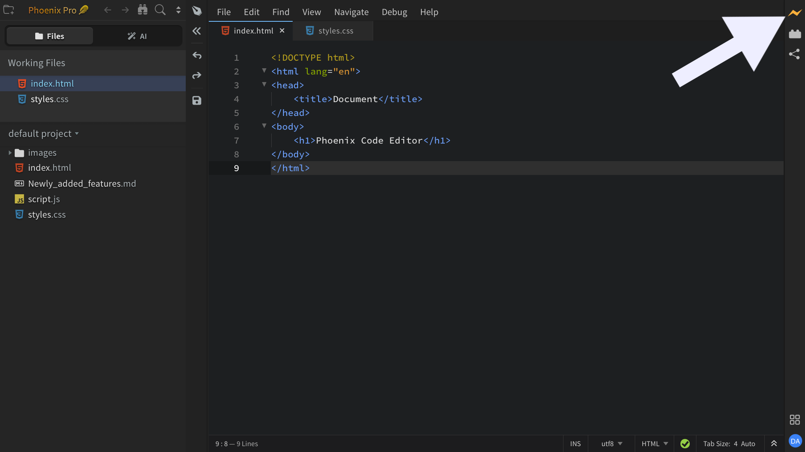
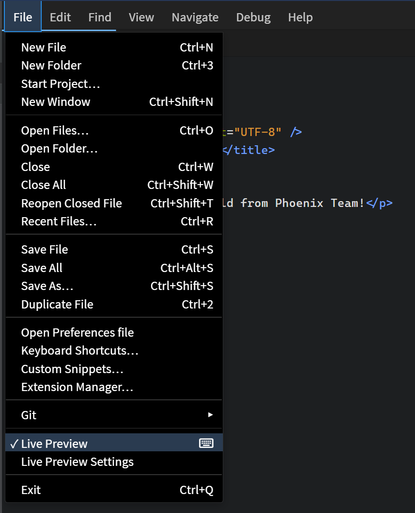
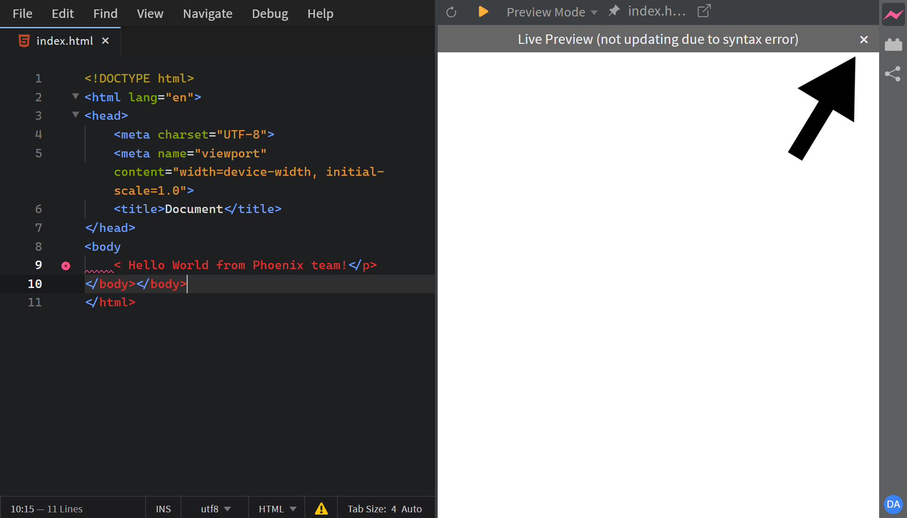
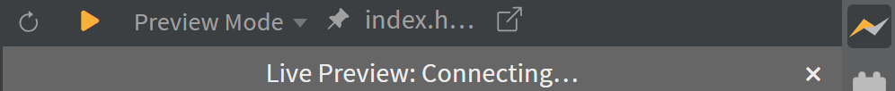
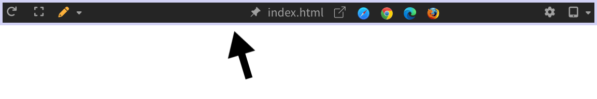
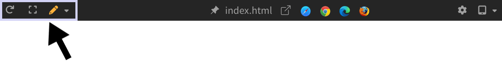
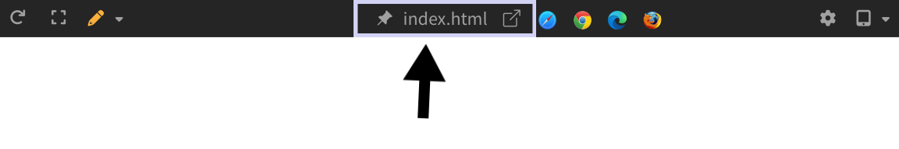
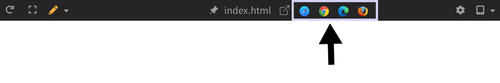
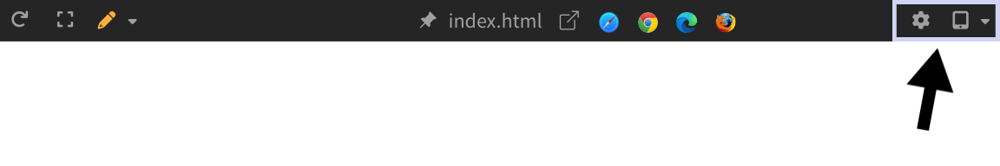

import React from 'react';
import VideoPlayer from '@site/src/components/Video/player';

The **Live Preview** feature in **Phoenix Code** provides instant feedback on changes made to **HTML** and **CSS** files, letting you see your edits in real-time.

> For HTML files, Live Preview is enabled by default. For other file types, you might need to do some manual setup.

## Showing or Hiding Live Preview

To show or hide Live Preview, click the **Lightning Bolt** icon at the top of the right toolbar.

> This button toggles the visibility of the Live Preview panel.

Alternatively, toggle from `File > Live Preview` or use the keyboard shortcut (default: `Ctrl + Alt + L` on Windows/Linux, `Cmd + Alt + L` on macOS).

To customize the keyboard shortcut, see the [Keyboard Shortcuts Guide](../keyboard-shortcuts).

## Understanding the Bolt Icon

The Live Preview bolt icon appears in different colors, each indicating a different status:

* **Gray bolt**: Live Preview is currently turned off.

* **Half yellow bolt**: Live Preview is connecting.

* **Full yellow bolt**: Live Preview is successfully connected. Changes will now appear in real-time.

* **Pink bolt**: There is a syntax error in your code. Live Preview is not updating because of that.

> You can also hover over the bolt icon to see a tooltip showing the current status.

<!-- @devansh - commenting this out for now because we are not shipping status overlays -->
<!-- ### Status Overlays

When there's a syntax error, the bolt icon turns pink and Phoenix Code also displays an overlay in Live Preview stating that there is an error.

You can close this overlay by clicking the `×` icon and the overlay won't appear again.

Phoenix Code also displays a connecting overlay while Live Preview is establishing a connection.

 -->

## Live Preview Toolbar

Phoenix Code provides various options in the Live Preview toolbar.

> The browser icons and settings button are hidden by default and appear only on hover.

### Toolbar Options

The left side of the toolbar groups three controls:

* **Reload Live Preview**: The leftmost icon is the reload icon. Clicking on it refreshes the Live Preview. It is useful when Live Preview gets out of sync with your code.

* **Design Mode**: The maximize icon after the reload button is for Design Mode. This mode hides the editor and expands the Live Preview to take over the full window, giving you more room to work on the page with [Edit Mode](../../Pro%20Features/edit-mode-live-preview) or [Phoenix Code AI](../../Pro%20Features/ai-chat). Click the icon again to exit Design Mode.

* **Live Preview Modes**: The pen icon lets you quickly switch between [Edit Mode](../../Pro%20Features/edit-mode-live-preview) and Preview Mode. The pen lights up when Edit Mode is active. You can also press `F8` to toggle between these two modes.

  For more mode options, click the chevron next to the pen icon. This opens a dropdown where you can select from all available Live Preview modes:

  

  - **Preview Mode**: View-only. The page behaves like a normal browser but still updates as you edit code. All interactions with the page (clicks, hovers, etc.) are disabled.
  - **Highlight Mode**: Click any element to see its paddings and margins. Phoenix Code also jumps to that element in your source code so you can start editing right away.
  - **Edit Mode**: Edit elements directly in the preview. Insert elements, change text, drag elements, swap images, and more. Phoenix Code updates your source code automatically. [Learn more](../../Pro%20Features/edit-mode-live-preview).

  When Edit Mode is active, two extra options appear in the same dropdown:

  - **Inspect Element on Hover**: Highlights elements as you hover, instead of only on click. This option is enabled by default. [Learn more](../../Pro%20Features/edit-mode-live-preview#inspect-element-on-hover).
  - **Show Measurements**: Displays ruler lines from the edges of the selected element to the edges of the Live Preview, with labels showing the exact pixel positions. This option is disabled by default. [Learn more](../../Pro%20Features/measurements).

  <VideoPlayer
    src="https://docs-images.phcode.dev/website/videos/lp-edit-pro-dialog.mp4"
  />

  :::note
  Edit Mode is a Phoenix Pro feature.
  :::

The center section of the toolbar groups three controls for the currently previewed page:

* **Pin or Unpin Preview Page**: The pin icon on the left. Pin a file in Live Preview so it remains displayed even when you switch to other files. Click again to unpin.

* **File Name**: The label in the middle shows the name of the currently previewed file. Click it to open that file in the editor (if not already open).

* **Pop Out to New Window**: The arrow icon on the right. Opens Live Preview in your default browser. Use this when you want to see how your page looks in a full browser window.

* **Browser Icons**: Select a specific browser icon to open the page in that browser. This helps you see how your page looks across different browsers. The icons are hidden by default and only appear when you hover over the toolbar.

  :::note
  This option is available only in Desktop apps.
  :::

The right end of the toolbar has two controls:

* **Live Preview Settings**: The gear icon on the left. Clicking it opens the Live Preview settings dialog. This icon is hidden by default and only appears when you hover over the toolbar. [Read more about Live Preview Settings](./live-preview-settings/#accessing-live-preview-settings).

* **Device Size Presets**: Resize the Live Preview to common phone, tablet, and desktop widths. Click the icon to cycle through sizes, or click the chevron for the full list. See [Resize Ruler](../../Pro%20Features/resize-ruler) for more.

  <VideoPlayer
    src="https://docs-images.phcode.dev/website/videos/device-size-pro-dialog.mp4"
  />

  :::note
  Device Size Presets is a Phoenix Pro feature.
  :::

## Using Live Preview with HTML Files

1. Open the HTML file you want to preview.
2. Click the **Lightning Bolt** icon to open Live Preview (if it's closed).
3. Make changes to the HTML file and see them update in Live Preview in real-time.

> If changes don't appear, reload Live Preview and wait until the bolt icon turns full yellow.

## Live Preview Demonstrated

<VideoPlayer
  src="https://docs-images.phcode.dev/videos/phcode.io-site/live_preview.mp4"
/>

