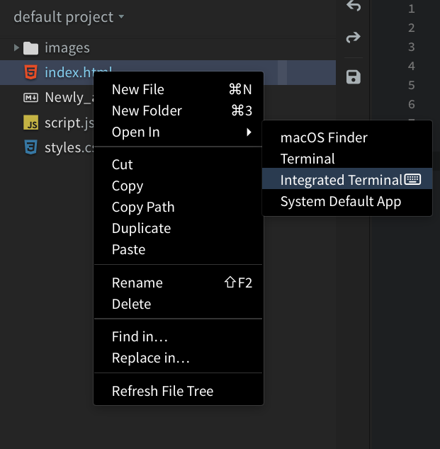
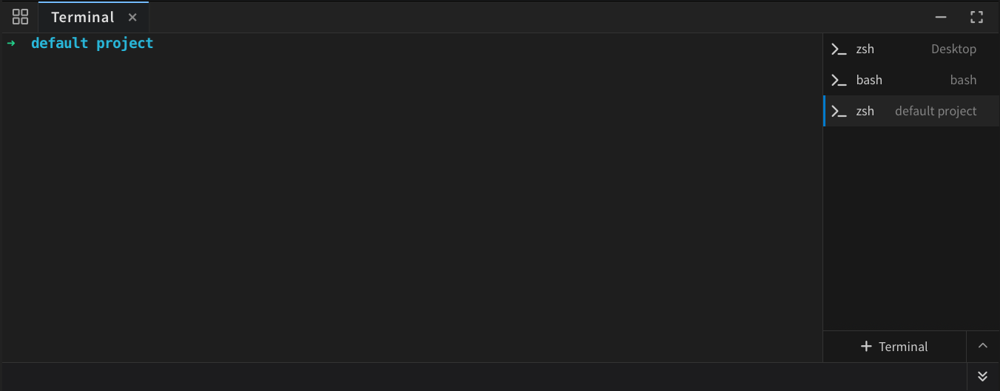

import React from 'react';
import VideoPlayer from '@site/src/components/Video/player';

Phoenix Code has a built-in terminal so you can run commands without leaving the editor.

> The terminal is available only in desktop apps.

<VideoPlayer src="https://docs-images.phcode.dev/videos/terminal/terminal-workflow.mp4" />

## Opening the Terminal

Open the terminal in any of these ways:

- Click the **Tools** button *(grid icon)* in the bottom-right toolbar and select **Terminal**
- Go to **View > Terminal** from the menu bar
- Press `F4`
- Right-click a file or folder in the project tree and choose **Integrated Terminal**. The terminal opens at that folder (or the file's containing folder)

## Tabs

You can have multiple terminals open at the same time, each in its own tab. The tab sidebar shows the running process name for each terminal.

To create a new tab, click the **+** button at the bottom of the tab sidebar.

To close a single tab, hover over it and click the **X** button. To close every terminal at once, click the panel's X button. Phoenix Code asks for confirmation if any process is still running.

When the terminal is focused and more than one tab is open, pressing `F4` cycles to the next tab.

## Shell Selection

Click the **dropdown button** *(chevron icon)* next to the new tab button to pick a different shell. The default options are:

- **macOS**: zsh, bash, fish
- **Linux**: bash, zsh, fish
- **Windows**: PowerShell, Command Prompt, Git Bash, WSL

Selecting a shell sets it as the default and opens a new terminal with it right away.

> Only shells installed on your system are shown. Any other compatible shell on your system (for example, PowerShell Core on Windows) also appears in the list.

## Keyboard Shortcuts

| Action | Shortcut |
|--------|----------|
| Toggle terminal / cycle to next instance (when more than one is open) | `F4` |
| Switch focus between editor and terminal | `Shift + Escape` |
| Clear terminal buffer | `Ctrl/Cmd + K` |
