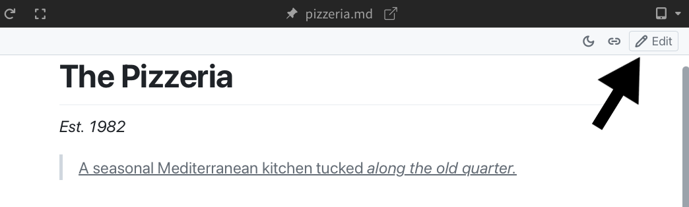
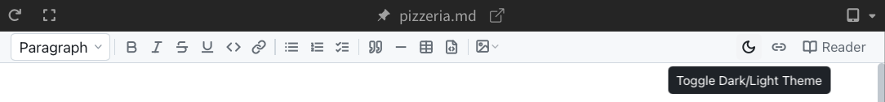
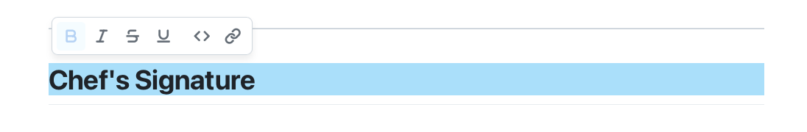
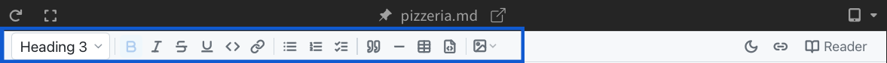
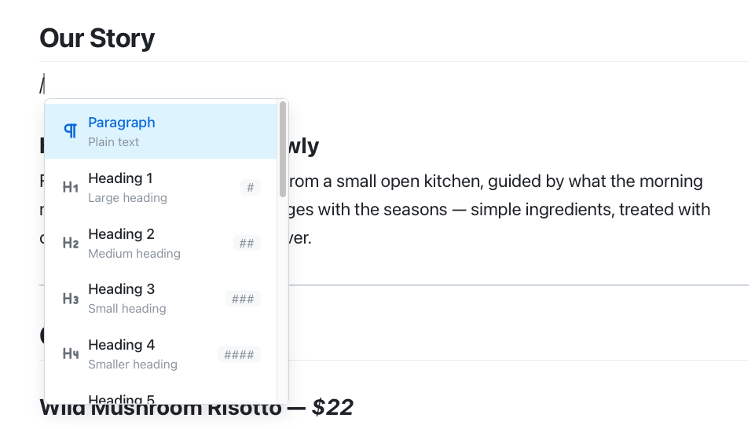
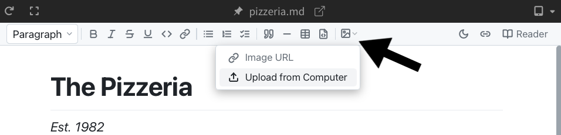

import React from 'react';
import VideoPlayer from '@site/src/components/Video/player';

:::info Pro Feature
[Upgrade to Phoenix Code Pro](https://phcode.io/pricing) to access this feature.
:::

Phoenix Code supports a full rich text editing experience for Markdown files, right inside the Live Preview. Format text, build tables, drop in images, add links, use slash commands, and watch every change sync back to your source code instantly.

<VideoPlayer
  src="https://docs-images.phcode.dev/website/videos/markdown-pro-dialog.mp4"
/>

## What you can do

Open any `.md` file and you get a beautiful WYSIWYG editor that stays perfectly in sync with the source.

- **[Type the way you read](#text-formatting)** — bold, headings, lists, blockquotes, and tables work like in any modern document editor.
- **[Slash menu](#slash-menu)** (`/`) inserts blocks, images, tables, and more without remembering syntax.
- **[Tables](#table-editing)** with right-click row/column controls and easy copy/paste.
- **[Drop or paste images](#images)** straight into your document.
- **Find in document** with `Ctrl+F`, **[print](#theme-and-print)** with a clean light theme.
- **[Dark and light themes](#theme-and-print)** match the rest of the app.
- **[Side-by-side sync](#cursor-sync)** — your source view and rich view scroll, select, and edit together.

## Enabling Edit Mode

To start editing, click the **Edit** button on the right side of the markdown toolbar. The toolbar expands to show formatting options, and you can start making changes right away.

To go back to the read-only view, click **Reader** in the same place.



> By default, markdown files open in Edit mode for **Phoenix Code Pro** users.

## Cursor Sync

Click anywhere in the preview to jump the editor cursor to the matching line. The line briefly highlights so you can see where you landed. Cursor sync works in the other direction too. Clicking a line in the editor scrolls the preview to that line.

Scrolling in either view does the same: the other view follows along to keep you in sync.

Use the **cursor sync** button in the toolbar to toggle this behavior on or off.

<VideoPlayer
  src="https://docs-images.phcode.dev/videos/markdown/toggle-cursor-sync.mp4"
/>

## Theme and Print

You can also switch the markdown preview between light and dark themes using the **theme toggle** in the toolbar, or print the rendered document with the **print** button.



> Print is not available on macOS desktop apps.

## Text Formatting

Select the text you want to format and click a formatting button, or use the keyboard shortcut. If no text is selected, the formatting applies to the word at your cursor.

- **Bold** (`Ctrl/Cmd + B`)
- **Italic** (`Ctrl/Cmd + I`)
- **Underline** (`Ctrl/Cmd + U`)
- **Strikethrough** (`Ctrl/Cmd + Shift + X`)
- **Inline Code** (`Ctrl/Cmd + E`)

You can also select text and use the **floating format bar** that appears near your selection.



## Blocks and Lists

The toolbar lets you change the current block type using a **block type dropdown** (Paragraph, Heading 1 through Heading 5) and insert different types of content:

- **Bullet list**, **Numbered list**, **Task list** (checklist with checkboxes)
- **Blockquote**, **Divider** (horizontal line)
- **Code block** with an optional language picker
- **Table** (see [Table Editing](#table-editing))
- **Mermaid diagram** with a syntax editor and live rendered preview



## Slash Menu

Type `/` at the start of an empty line to open the **Slash Menu**. This gives you a quick way to insert any block type without reaching for the toolbar.



Start typing to filter the list. Use the arrow keys to navigate and press `Enter` to insert.

> The Slash Menu shows your most-used items first.

### Markdown Shortcuts

You can also use standard Markdown shortcuts as you type:

- `# ` through `##### ` for headings
- `- ` or `* ` for bullet lists
- `1. ` for numbered lists
- `- [ ] ` for task lists
- `> ` for blockquotes
- ` ``` ` for code blocks
- `---` for dividers

## Table Editing

When you insert a table, you can edit it directly in the preview. Click any cell to start typing in it. Use `Tab` to move to the next cell.

Right-click a cell to open a context menu with options to:

- Insert or delete rows
- Insert or delete columns
- Copy, cut, and paste rows or columns
- Delete the entire table

You can also click the **+ New row** button below the table to add a row.

<VideoPlayer
  src="https://docs-images.phcode.dev/videos/markdown/markdown-editor-table.mp4"
/>

## Images

Paste images into Markdown like you would in a document editor.

Normally, adding images to Markdown means saving the image, uploading it somewhere, copying the URL, and then pasting that URL into your file. Phoenix Code removes that extra work.

You can add images by pasting from your clipboard, uploading from your computer, or using an existing image URL.

- **Paste from clipboard** — copy an image or screenshot and paste it directly into the editor
- **Upload from your computer** — pick an image file from your device
- **From a URL** — enter the image URL and alt text in a dialog

When you paste an image or upload one from your computer, Phoenix Code can upload it to the Phoenix CDN and insert the Markdown image link automatically. The first time you do this, Phoenix Code will ask for confirmation before using the CDN.

The **Upload from Computer** and **Image URL** options are available from the **Image** button in the toolbar or through the [Slash Menu](#slash-menu). Clipboard images can be pasted directly into the editor using **Ctrl+V** or **Cmd+V**.




Click an image in the editor to see a popover with **Edit** and **Delete** buttons.

## Links

To add a link, select some text and click the **Link** button in the toolbar (or press `Ctrl/Cmd + K`). Enter the URL in the floating input that appears and press `Enter`.

Click an existing link to see a popover showing the URL, with options to **Edit** or **Remove** the link.

<VideoPlayer
  src="https://docs-images.phcode.dev/videos/markdown/markdown-editor-links.mp4"
/>

## Keyboard Shortcuts

| Action | Shortcut |
|--------|----------|
| Bold | `Ctrl/Cmd + B` |
| Italic | `Ctrl/Cmd + I` |
| Underline | `Ctrl/Cmd + U` |
| Strikethrough | `Ctrl/Cmd + Shift + X` |
| Inline Code | `Ctrl/Cmd + E` |
| Link | `Ctrl/Cmd + K` |
| Undo | `Ctrl/Cmd + Z` |
| Redo | `Ctrl/Cmd + Y` or `Ctrl/Cmd + Shift + Z` |
| Search | `Ctrl/Cmd + F` |
| Select All | `Ctrl/Cmd + A` |
