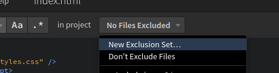
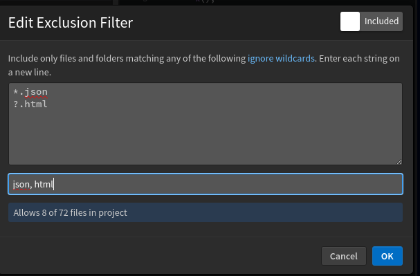

# Find In Files

The Find in Files feature in Phoenix Code is a powerful tool to quickly search for specific text across multiple files within a project. This feature is useful for developers working on large codebases to find references, variable names, or specific lines of code.

To search across your project files, use `Ctrl-Shift-F` on Windows/Linux or `Cmd-Shift-F` on Mac, or select `Find > Find in Files` from the menu. This feature searches for your term throughout the project's files and displays each occurrence with its file name, line number, and a snippet of the code for context.



## Using File Filters

By default, Find in Files searches all files in your project folder. You can exclude or include files, file types, whole folders, or other patterns:

* Click the "No Files Excluded" dropdown from the search bar.

  
* Choose "New Exclusion Set"
* Enter one or more patterns to exclude/include in the dialog.

To edit an exclusion set later, open the same dropdown and hover over the exclusion set in the list to reveal a pencil icon - click this to edit it.

## Creating an Exclusion/Inclusion Filter

The Edit Exclusion Filter dialog in Phoenix allows you to specify which files and folders should be excluded or included during project searches.



### For Exclusion

When the toggle is set to "Excluded", the filter will ignore files and folders that match the patterns you enter. For instance, typing `*.json` in the text area will exclude all JSON files from your search results. The dialog will show a status message like "Allows 67 of 72 files in project," meaning that 5 files matching the pattern will not be included in the search.

### For Inclusion

When the toggle is switched to "Included", the filter will search only within files and folders that match the entered patterns. Entering `*.json` will include only JSON files in your search results. The status message, such as "Allows 5 of 72 files in project," indicates that only 5 files fitting the pattern will be searchable.

## The filter pattern

This section describes the format of the exclusion/inclusion glob pattern.

1. Each pattern should be entered in its own line. You can specify multiple patterns in its own line Eg. 
   ```txt
   *.js
   *.json
   ```
1. `*.js` will match `a/b/x.js`, `xyx.js`
1. `?.js` will match only `a/b/x.js` and not `xyx.js`
1. `**/some_folder/**` will match `some_folder` anywhere. More complex glob patterns can be provided.
