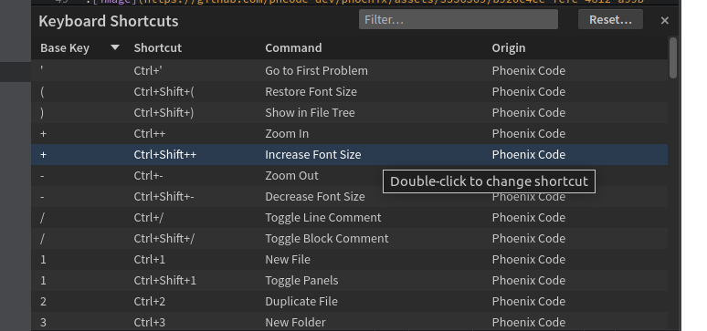
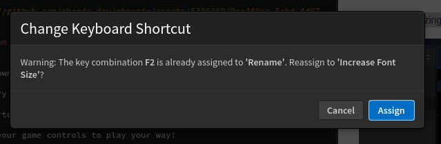
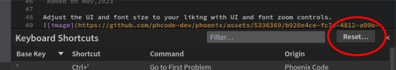

# Change Keyboard Shortcuts

Now you can make your own shortcuts for any menu, so you don't have to memorize a bunch of different ones for every app. It's like customizing your game controls to play your way!
This feature is accessible in two ways: via the menu items or through the Keyboard Shortcuts panel.

## Accessing Change Keyboard Shortcut Feature

### Via Menu Items

- Navigate to any main menu (e.g., File, Edit, View).
- Hover over the menu item for which you want to change the shortcut.
- An icon resembling a keyboard will appear to the right of the menu item.
- Click this icon to open the Change Keyboard Shortcut dialog.

### Via Keyboard Shortcuts Panel

- Open the Keyboard Shortcuts panel by selecting `Keyboard Shortcuts...` from the `File` menu.
- The panel displays a list of all available commands with their associated shortcuts.
- Locate the command for which you want to change the shortcut.
- Double-click on the shortcut, or click the command and then the `Change Keyboard Shortcut` button that appears.

## Changing a Keyboard Shortcut

1. **Initiating the Change**:
   - When you initiate a change through either method mentioned above, a dialog box will appear prompting you to press the new key combination for the command.

2. **Pressing the New Combination**:
   - Press the keys for your new desired shortcut.
   - If the combination is already assigned to another command, you will be notified and given the option to choose another combination or to overwrite the existing one by pressing `Assign`.

3. **Confirmation**:
   - After pressing the desired combination, if it is free, it will be set immediately.

4. **Removing a Shortcut**:
   - If you wish to remove a shortcut altogether, you may have the option to click a 'Remove' button in the Change Keyboard Shortcut dialog, which unbinds the current shortcut from the command.

5. **Cancellation**:
   - If you change your mind, you can cancel the operation by clicking the 'Cancel' button, closing the dialog, or pressing the 'Escape' key.

## Resetting Shortcuts

Users can reset all shortcuts to factory defaults using the 'Reset' button in the Keyboard Shortcuts panel.

## Additional Notes

- **Persistence**: Changes to keyboard shortcuts are saved automatically and will persist across sessions.
